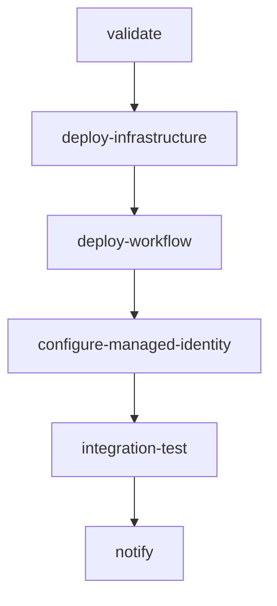

# GitHub Actions CI/CD

Azure Logic Apps 보안 블로그 자동 요약 시스템의 CI/CD 파이프라인입니다.

## 📁 파일 구조

```
.github/workflows/
├── deploy.yml      # Azure 배포 워크플로
└── README.md       # 이 파일
```

## 🚀 배포 워크플로 (deploy.yml)

### 트리거

- **Push**: `master` 브랜치에 Push 시 자동 실행 (dev 환경)
- **Manual**: GitHub Actions UI에서 수동 실행 (dev/prod 선택 가능)

### Jobs 구조



#### 1. validate
- Bicep 템플릿 검증
- 문법 오류, 파라미터 누락 확인

#### 2. deploy-infrastructure
- Resource Group 생성 (없으면)
- Bicep 템플릿 배포
- Outputs 추출 (Logic App 이름, ID)

#### 3. deploy-workflow
- Logic App 워크플로 JSON 업로드
- Parameters 설정

#### 4. configure-managed-identity
- Logic App Managed Identity Principal ID 추출
- Azure OpenAI 리소스에 역할 할당

#### 5. integration-test
- Logic App 수동 트리거 실행
- 30초 대기
- Run Status 확인 (Succeeded/Failed)

#### 6. notify
- 배포 성공/실패 알림

## 🔐 필요한 Secrets

GitHub Repository → Settings → Secrets and variables → Actions에서 설정하세요.

| Secret 이름 | 설명 | 예시 값 |
|-------------|------|--------|
| `AZURE_CLIENT_ID` | Service Principal Client ID | `xxxxxxxx-xxxx-xxxx-xxxx-xxxxxxxxxxxx` |
| `AZURE_TENANT_ID` | Azure AD Tenant ID | `xxxxxxxx-xxxx-xxxx-xxxx-xxxxxxxxxxxx` |
| `AZURE_SUBSCRIPTION_ID` | Azure 구독 ID | `xxxxxxxx-xxxx-xxxx-xxxx-xxxxxxxxxxxx` |
| `EMAIL_RECIPIENT` | 이메일 수신자 주소 | `your-email@example.com` |
| `OPENAI_ENDPOINT` | Azure OpenAI 엔드포인트 | `https://your-openai.openai.azure.com/` |
| `OPENAI_DEPLOYMENT_NAME` | GPT-4 배포 이름 | `gpt-4` |
| `OPENAI_RESOURCE_ID` | Azure OpenAI 리소스 ID | `/subscriptions/{sub-id}/resourceGroups/{rg}/providers/Microsoft.CognitiveServices/accounts/{name}` |

## 🔧 Service Principal 생성

### 1. Azure CLI로 생성

```bash
# 1. Service Principal 생성 (Federated Credential 사용)
az ad sp create-for-rbac \
  --name "github-actions-security-blog-automation" \
  --role "Contributor" \
  --scopes /subscriptions/{subscription-id} \
  --sdk-auth

# 2. 출력된 JSON에서 값 추출
# - clientId → AZURE_CLIENT_ID
# - clientSecret (사용 안 함, Federated Credential 사용)
# - subscriptionId → AZURE_SUBSCRIPTION_ID
# - tenantId → AZURE_TENANT_ID
```

### 2. Federated Credential 설정 (OpenID Connect)

```bash
# 1. App Registration 찾기
APP_ID=$(az ad sp list --display-name "github-actions-security-blog-automation" --query "[0].appId" -o tsv)

# 2. Federated Credential 추가
az ad app federated-credential create \
  --id $APP_ID \
  --parameters '{
    "name": "github-actions-oidc",
    "issuer": "https://token.actions.githubusercontent.com",
    "subject": "repo:zer0big/azure-security-blog-automation:ref:refs/heads/master",
    "audiences": ["api://AzureADTokenExchange"]
  }'
```

### 3. Azure OpenAI 리소스 ID 확인

```bash
az cognitiveservices account show \
  --resource-group {openai-rg} \
  --name {openai-name} \
  --query id -o tsv
```

## 🧪 로컬에서 테스트

### 1. Azure CLI 로그인

```bash
az login
az account set --subscription {subscription-id}
```

### 2. Bicep 템플릿 검증

```bash
az deployment group validate \
  --resource-group rg-security-blog-automation-dev \
  --template-file infra/bicep/main.bicep \
  --parameters @infra/bicep/parameters.dev.json \
  --parameters emailRecipient=your-email@example.com \
  --parameters openAiEndpoint=https://your-openai.openai.azure.com/ \
  --verbose
```

### 3. 수동 배포

```bash
# Resource Group 생성
az group create \
  --name rg-security-blog-automation-dev \
  --location koreacentral

# Bicep 배포
az deployment group create \
  --resource-group rg-security-blog-automation-dev \
  --template-file infra/bicep/main.bicep \
  --parameters @infra/bicep/parameters.dev.json \
  --parameters emailRecipient=your-email@example.com \
  --parameters openAiEndpoint=https://your-openai.openai.azure.com/

# 워크플로 업로드
az logic workflow update \
  --resource-group rg-security-blog-automation-dev \
  --name logic-dev-security-blog-automation \
  --definition @workflows/security-blog-summarizer.json
```

## 📊 모니터링

### GitHub Actions 로그 확인

1. GitHub Repository → Actions 탭
2. 최근 워크플로 실행 클릭
3. 각 Job별 로그 확인

### Azure Portal에서 확인

1. Azure Portal → Resource Groups → rg-security-blog-automation-dev
2. Logic App → Run History 확인
3. Application Insights → Logs 쿼리

## 🔄 배포 시나리오

### 시나리오 1: 개발 환경 자동 배포

1. 로컬에서 코드 수정
2. `git push origin master`
3. GitHub Actions 자동 실행 (dev 환경)
4. 5-10분 후 배포 완료

### 시나리오 2: 프로덕션 수동 배포

1. GitHub Repository → Actions → Deploy to Azure
2. "Run workflow" 클릭
3. Environment 선택: `prod`
4. "Run workflow" 실행
5. Integration Test 성공 확인

### 시나리오 3: 롤백

```bash
# 이전 배포로 롤백
az deployment group create \
  --resource-group rg-security-blog-automation-prod \
  --template-file infra/bicep/main.bicep \
  --parameters @infra/bicep/parameters.prod.json \
  --mode Complete
```

## ⚠️ 주의사항

### 1. Service Principal 권한

- **최소 권한 원칙**: Contributor 역할 (구독 레벨)
- **환경별 분리**: dev, prod별 Service Principal 생성 권장

### 2. Secrets 관리

- **절대 커밋 금지**: `.env`, `parameters.*.json`에 민감 정보 포함 금지
- **정기 갱신**: Service Principal 자격 증명 6개월마다 갱신

### 3. 비용 관리

- **테스트 실행 제한**: Integration Test는 필요 시에만 실행
- **리소스 자동 삭제**: dev 환경은 야간에 자동 삭제 고려

### 4. 배포 실패 대응

- **로그 확인**: GitHub Actions 로그, Azure Activity Log
- **수동 수정**: Azure Portal에서 직접 수정 가능 (IaC 동기화 주의)

## 📚 참고 자료

- [GitHub Actions for Azure](https://github.com/Azure/actions)
- [Azure Login Action](https://github.com/Azure/login)
- [Logic Apps CI/CD](https://learn.microsoft.com/azure/logic-apps/devops-deployment)
- [Azure CLI in GitHub Actions](https://learn.microsoft.com/azure/developer/github/connect-from-azure)
- [Federated Identity Credentials](https://learn.microsoft.com/azure/active-directory/develop/workload-identity-federation)

## 🛠️ 트러블슈팅

### 문제 1: Azure Login 실패

```
Error: Login failed with Error: ...
```

**해결**:
- Federated Credential 설정 확인
- Subject 값 정확성 확인: `repo:zer0big/azure-security-blog-automation:ref:refs/heads/master`

### 문제 2: Bicep 배포 실패

```
Error: Deployment failed with error: InvalidTemplate
```

**해결**:
- 로컬에서 `az deployment group validate` 실행
- Parameters 파일 값 확인

### 문제 3: Integration Test 실패

```
Run Status: Failed
```

**해결**:
- Azure Portal → Logic App → Run History 확인
- Office 365 API Connection 인증 확인
- Managed Identity 역할 할당 확인
