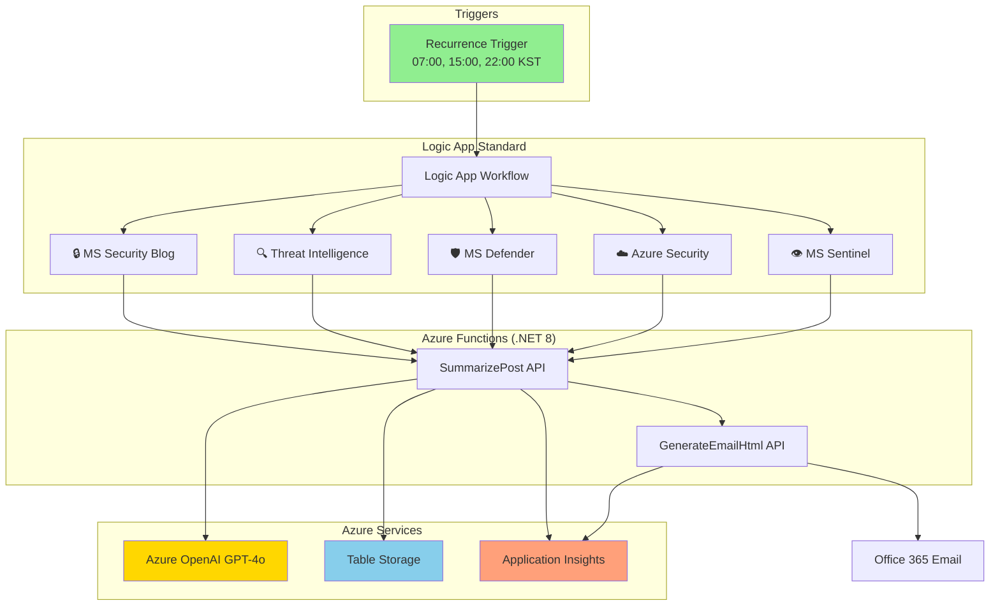

# Azure Security Blog Automation

Microsoft 보안 관련 블로그의 최신 게시글을 자동으로 수집하고 AI 요약과 함께 이메일로 발송하는 Azure 자동화 시스템입니다.

## 📋 Table of Contents

- [주요 기능](#-주요-기능)
- [아키텍처](#-아키텍처)
- [빠른 시작](#-빠른-시작)
- [구성 요소](#-구성-요소)
- [배포 가이드](#-배포-가이드)
- [프로젝트 구조](#-프로젝트-구조)
- [문서](#-문서)
- [이메일 형식](#-이메일-형식)
- [모니터링](#-모니터링)
- [문제 해결](#-문제-해결)
- [라이선스](#-라이선스)

## 🎯 주요 기능

- **5개 Microsoft 보안 RSS 피드 모니터링**
  - 🔒 Microsoft Security Blog
  - 🔍 MS Security - Threat Intelligence
  - 🛡️ Microsoft Defender (Tech Community)
  - ☁️ Azure Security Blog
  - 👁️ Microsoft Sentinel (Tech Community)

- **AI 기반 자동 요약** (Azure OpenAI GPT-4o)
  - 영문 핵심 인사이트 추출
  - 한국어 자동 번역 및 요약
  - 보안 이슈 핵심 포인트 강조

- **스마트 이메일 발송**
  - 신규 게시글 자동 감지
  - 중복 제거 (Azure Table Storage)
  - 일 3회 자동 발송 (07:00, 15:00, 22:00 KST)
  - 게시글 없을 시 간결한 요약 형식

## 🏗️ 아키텍처



**📖 상세 문서**:
- [아키텍처 상세 설명](docs/ARCHITECTURE.md)
- [Logic App 워크플로우 가이드](docs/LOGIC_APP_WORKFLOW.md)
- [배포 가이드](docs/DEPLOYMENT.md)

## 🚀 빠른 시작

### 사전 요구사항

- Azure Subscription
- Azure OpenAI 리소스 (GPT-4o 배포)
- Azure CLI
- .NET 8 SDK
- Azure Functions Core Tools v4

### 1분 배포 (PowerShell)

```powershell
# 1. 리포지토리 클론
git clone https://github.com/zer0big/azure-security-blog-automation.git
cd azure-security-blog-automation

# 2. 환경 변수 설정
$env:AZURE_OPENAI_ENDPOINT = "https://your-openai.openai.azure.com/"
$env:AZURE_OPENAI_KEY = "your-api-key"

# 3. 인프라 배포
cd infra
.\deploy.ps1 -AzureOpenAIEndpoint $env:AZURE_OPENAI_ENDPOINT -AzureOpenAIKey $env:AZURE_OPENAI_KEY

# 4. Function App 코드 배포
cd ../functions
func azure functionapp publish func-dev-security-blog-automation
```

**상세한 배포 가이드**: [DEPLOYMENT.md](docs/DEPLOYMENT.md)

## 📦 구성 요소

### Infrastructure as Code (IaC)

모든 Azure 리소스는 Bicep으로 정의되어 있으며, 재현 가능한 배포를 보장합니다.

```
infra/
├── bicep/
│   ├── main.bicep                    # 메인 오케스트레이션 템플릿
│   ├── modules/
│   │   ├── storage.bicep             # Storage Account + ProcessedPosts 테이블
│   │   ├── function-app.bicep        # Function App + App Service Plan
│   │   ├── logic-app.bicep           # Logic App + App Service Plan
│   │   └── app-insights.bicep        # Application Insights + Log Analytics
│   └── parameters/
│       └── dev.bicepparam            # 개발 환경 파라미터
├── logic-app/
│   └── workflow-full.json            # Logic App 워크플로우 정의
├── deploy.ps1                         # PowerShell 배포 스크립트
└── deploy.sh                          # Bash 배포 스크립트
```

### Azure Resources

- **Logic App (Standard)**: 워크플로우 오케스트레이션
- **Function App (.NET 8 Isolated)**:
  - `SummarizePost`: Azure OpenAI 기반 게시글 요약
  - `GenerateEmailHtml`: 이메일 HTML 생성
- **Azure Table Storage**: 처리된 게시글 중복 방지 (ProcessedPosts 테이블)
- **Azure OpenAI**: GPT-4o 모델 기반 요약 생성
- **Application Insights**: 모니터링 및 로깅
- **Office 365 Connector**: 이메일 발송

### RSS Feed 소스

#### SummarizePost
```csharp
// Azure OpenAI를 활용한 보안 게시글 요약
// 입력: 게시글 제목, 내용
// 출력: 영문 핵심 인사이트 3줄, 한국어 요약 3줄
```

#### GenerateEmailHtml
```csharp
// 이메일 HTML 생성
// 입력: 게시글 배열 (요약 포함)
// 출력: HTML 본문, 제목
// - 신규 있음: "[Microsoft Azure 업데이트] 새 게시글 N개"
// - 신규 없음: "[Microsoft Azure 업데이트] 최근 게시글 요약 (신규 없음)"
```

## 🚀 배포 방법

### 사전 요구사항

- Azure 구독
- Azure CLI 설치
- .NET 8 SDK
- PowerShell 7+

### 1. Azure 리소스 배포

```bash
# 리소스 그룹 생성
az group create --name rg-security-blog-automation-dev --location koreacentral

# Storage Account 생성
az storage account create \
  --name stdevsecurityblog \
  --resource-group rg-security-blog-automation-dev \
  --location koreacentral \
  --sku Standard_LRS

# Function App 생성
az functionapp create \
  --name func-dev-security-blog-automation \
  --resource-group rg-security-blog-automation-dev \
  --storage-account stdevsecurityblog \
  --consumption-plan-location koreacentral \
  --runtime dotnet-isolated \
  --runtime-version 8 \
  --functions-version 4
```

### 2. Functions 배포

```bash
cd functions
dotnet clean
dotnet publish --configuration Release --output ./publish
cd publish
zip -r ../deploy.zip .
az functionapp deployment source config-zip \
  --resource-group rg-security-blog-automation-dev \
  --name func-dev-security-blog-automation \
  --src ../deploy.zip
```

### 3. Logic App 설정

Azure Portal에서 Logic App Designer를 통해 워크플로우 구성:

1. **Recurrence 트리거**: 일 3회 (7, 15, 22시 KST)
2. **RSS 커넥터**: 5개 피드 병렬 처리
3. **Table Storage**: 중복 체크
4. **Function 호출**: SummarizePost, GenerateEmailHtml
5. **Office 365**: 이메일 발송

## ⚙️ 환경 변수

### Function App 설정

```bash
# Azure OpenAI 설정
AZURE_OPENAI_ENDPOINT=https://your-openai.openai.azure.com/
AZURE_OPENAI_KEY=your-key-here
AZURE_OPENAI_DEPLOYMENT=gpt-4o

# Storage 설정
AzureWebJobsStorage=DefaultEndpointsProtocol=https;...
STORAGE_CONNECTION_STRING=DefaultEndpointsProtocol=https;...
```

## 📧 이메일 형식

### 신규 게시글 있을 때
```
제목: [Microsoft Azure 업데이트] 새 게시글 3개

본문:
┌─────────────────────────────┐
│ ☁️ Microsoft Azure 업데이트  │
│    새로운 게시글 3개         │
└─────────────────────────────┘

🔒 Microsoft Security Blog
제목: CVE-2025-12345 보안 업데이트
💡 Key Insights (AI Summary)
- Critical vulnerability patched...
🇰🇷 핵심 인사이트 (한국어 요약)
- 긴급 보안 패치 배포...
```

### 신규 게시글 없을 때
```
제목: [Microsoft Azure 업데이트] 최근 게시글 요약 (신규 없음)

본문:
┌─────────────────────────────┐
│ ☁️ Microsoft Azure 업데이트  │
│    새로운 게시글 0개         │
└─────────────────────────────┘

🔒 Microsoft Security Blog: No new posts in last 24 hours
🔍 MS Security - Threat Intelligence: No new posts in last 24 hours
...
```

## 🔧 주요 설정

### RSS 피드 목록

| 이모지 | 피드 이름 | URL |
|-------|----------|-----|
| 🔒 | Microsoft Security Blog | https://www.microsoft.com/en-us/security/blog/feed/ |
| 🔍 | MS Security - Threat Intelligence | https://www.microsoft.com/en-us/security/blog/topic/threat-intelligence/feed/ |
| 🛡️ | TC - Microsoft Defender | https://techcommunity.microsoft.com/plugins/custom/microsoft/o365/custom-blog-rss?board=MicrosoftDefenderATPBlog |
| ☁️ | Azure Security Blog | https://techcommunity.microsoft.com/plugins/custom/microsoft/o365/custom-blog-rss?board=AzureSecurityBlog |
| 👁️ | TC - Microsoft Sentinel | https://techcommunity.microsoft.com/plugins/custom/microsoft/o365/custom-blog-rss?board=MicrosoftSentinelBlog |

### 스케줄

- 매일 07:00 KST
- 매일 15:00 KST
- 매일 22:00 KST

## 📝 라이선스

MIT License

## 👤 작성자

**Zero Big**
- Email: azure-mvp@zerobig.kr
- GitHub: [@zer0big](https://github.com/zer0big)

## 🙏 감사의 말

이 프로젝트는 Microsoft Azure 서비스들을 활용하여 보안 정보의 신속한 전파를 목표로 합니다.

