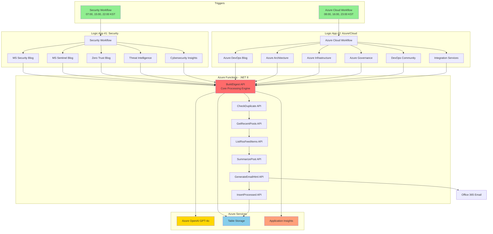

# Azure Security Blog Automation

Microsoft 보안 관련 블로그의 최신 게시글을 자동으로 수집하고 AI 요약과 함께 이메일로 발송하는 Azure 자동화 시스템입니다.

## 📋 Table of Contents

- [주요 기능](#-주요-기능)
- [아키텍처](#-아키텍처)
- [빠른 시작](#-빠른-시작)
- [**🆕 완전 초보자용 구축 가이드**](docs/STEP-BY-STEP-DEPLOYMENT-GUIDE.md) ⭐
- [구성 요소](#-구성-요소)
- [배포 가이드](#-배포-가이드)
- [프로젝트 구조](#-프로젝트-구조)
- [문서](#-문서)
- [이메일 형식](#-이메일-형식)
- [모니터링](#-모니터링)
- [문제 해결](#-문제-해결)
- [라이선스](#-라이선스)

## 🎯 주요 기능

### 📰 **두 개의 자동화 워크플로우**

#### **워크플로우 #1: Security Blog (5개 피드)**
- 🛡️ Microsoft Security Blog
- 🔐 Microsoft Sentinel Blog  
- 🌐 Zero Trust Blog
- 🎯 Threat Intelligence
- 💡 Cybersecurity Insights
- ⏰ 스케줄: 매일 07:00, 15:00, 22:00 (KST)

#### **워크플로우 #2: Azure/Cloud Blog (6개 피드)**
- 🔧 Azure DevOps Blog
- 📊 Azure Architecture Blog
- 🏗️ Azure Infrastructure Blog
- 🏢 Azure Governance and Management Blog
- 🔨 Azure DevOps Community
- ⚡ Azure Integration Services Blog
- ⏰ 스케줄: 매일 08:00, 16:00, 23:00 (KST)

### 🤖 **AI 기반 자동 요약** (Azure OpenAI GPT-4o)
  - 📝 **블로그 첫 문단 추출**: 실제 블로그 페이지 웹 스크래핑으로 본문 첫 문단 발췌
  - 💡 **한국어 핵심 인사이트**: AI가 전체 블로그를 분석하여 핵심 인사이트 3줄 요약 (단순 번역이 아님)
  - 🔍 **스마트 필터링**: FAIL 피드 자동 제외, 24시간 내 신규 게시물만 표시
  - 🎨 이모지로 피드 출처 시각화

### 📧 **스마트 이메일 발송**
  - 신규 게시글 자동 감지
  - 중복 제거 (Azure Table Storage)
  - 일 6회 자동 발송 (총 2개 워크플로우)
  - 게시글 없을 시 간결한 요약 형식

## 🏗️ 아키텍처



**📖 상세 문서**:
- [아키텍처 상세 설명](docs/아키텍처.md)
- [Logic App 워크플로우 가이드](docs/Logic-App-워크플로우.md)
- [배포 가이드](docs/배포-가이드.md)

## 🚀 빠른 시작

### 사전 요구사항

- Azure Subscription
- Azure OpenAI 리소스 (GPT-4o 배포)
- Azure CLI
- .NET 8 SDK
- Azure Functions Core Tools v4

### 1분 배포 (PowerShell)

```powershell
# 1. 리포지토리 클론
git clone https://github.com/zer0big/azure-security-blog-automation.git
cd azure-security-blog-automation

# 2. 환경 변수 설정
$env:AZURE_OPENAI_ENDPOINT = "https://your-openai.openai.azure.com/"
$env:AZURE_OPENAI_KEY = "your-api-key"

# 3. 인프라 배포
cd infra
.\deploy.ps1 -AzureOpenAIEndpoint $env:AZURE_OPENAI_ENDPOINT -AzureOpenAIKey $env:AZURE_OPENAI_KEY

# 4. Function App 코드 배포
cd ../functions
func azure functionapp publish func-dev-security-blog-automation
```

**🆕 완전 초보자용 상세 가이드**: [STEP-BY-STEP-DEPLOYMENT-GUIDE.md](docs/STEP-BY-STEP-DEPLOYMENT-GUIDE.md)

## 📦 구성 요소

### Infrastructure as Code (IaC)

모든 Azure 리소스는 **Bicep**으로 정의되어 재현 가능한 배포를 보장합니다.

```
infra/
├── bicep/
│   ├── main.bicep                     # 메인 템플릿
│   ├── modules/                       # 모듈별 리소스 정의
│   └── parameters/dev.bicepparam      # 개발 환경 파라미터
├── logic-app/                     # Logic App 워크플로우 정의
├── deploy.ps1                     # PowerShell 배포 스크립트
└── deploy.sh                      # Bash 배포 스크립트
```

**상세 배포 가이드**: [docs/STEP-BY-STEP-DEPLOYMENT-GUIDE.md](docs/STEP-BY-STEP-DEPLOYMENT-GUIDE.md)

### Azure Resources

- **Logic App (Standard) × 2**: 워크플로우 오케스트레이션
  - Security Workflow: 5개 피드 (07:00, 15:00, 22:00 KST)
  - Azure/Cloud Workflow: 6개 피드 (08:00, 16:00, 23:00 KST)
  
- **Function App (.NET 8 Isolated)**: 7개 HTTP Trigger Functions
  - **`BuildDigest`**: 🔥 **통합 처리 엔진** (v3.0 핵심)
    - RSS 피드 병렬 수집 (FAIL 피드 자동 skip)
    - 웹 스크래핑: 실제 블로그 첫 문단 추출
    - AOAI 한국어 핵심 인사이트 생성 (배치 처리)
    - 24시간 신규 게시물 필터링
    - Table Storage 중복 제거 (SHA256 해시)
    - 이메일 HTML 생성 (첫 문단 + 인사이트)
  - `GetRecentPosts`: 최근 처리된 게시글 조회
  - `ListRssFeedItems`: RSS 피드 아이템 목록
  - `CheckDuplicate`, `SummarizePost`, `GenerateEmailHtml`, `InsertProcessed`: 레거시 API (현재 BuildDigest로 통합됨)

- **Azure Table Storage**: 중복 게시글 방지 (ProcessedPosts 테이블)
  - PartitionKey: 피드명
  - RowKey: SHA256(링크)
  
- **Azure OpenAI**: GPT-4o 기반 AI 인사이트 생성
- **Application Insights**: 실시간 모니터링 및 로깅
- **Office 365 Connector**: 자동 이메일 발송

## �️ 모니터링 및 운영

### Application Insights 쿼리

#### 최근 24시간 오류 확인
```kusto
traces
| where timestamp > ago(24h)
| where severityLevel >= 3
| summarize count() by cloud_RoleName, severityLevel
```

#### BuildDigest 실행 시간 분석
```kusto
requests
| where timestamp > ago(7d)
| where name == "BuildDigest"
| summarize avg(duration), max(duration), count() by bin(timestamp, 1h)
```

### 일반적인 문제 해결

| 증상 | 원인 | 해결 방법 |
|------|------|----------|
| AOAI fallback 텍스트 표시 | AOAI 환경변수 미설정 또는 quota 초과 | 환경변수 확인, quota 증설 |
| 웹 스크래핑 실패 | 블로그 구조 변경, timeout | HTML 패턴 업데이트, timeout 증가 |
| 신규 게시글 판별 오류 | 시간대 불일치 | newCutoff 로직 확인 |
| 이메일 미발송 | Office 365 connector 권한 | Logic App Designer에서 재인증 |

## 📧 이메일 형식

### 신규 게시글 있을 때
```
제목: [Microsoft Azure 업데이트] 새 게시글 3개

본문:
┌─────────────────────────────┐
│ ☁️ Microsoft Azure 업데이트  │
│    새로운 게시글 3개         │
└─────────────────────────────┘

🛡️ Microsoft Security Blog
제목: How Microsoft builds privacy and security to work hand in hand
📅 2026-01-13 18:00

📝 블로그 첫 문단
The Deputy CISO blog series is where Microsoft Deputy Chief Information 
Security Officers (CISOs) share their thoughts on what is most important 
in their respective domains...

💡 핵심 인사이트 (AI Summary)
- 마이크로소프트는 고급 도구와 글로벌 규정을 통해 개인정보 보호와 보안을 통합합니다
- 제로 트러스트 보안 프레임워크로 데이터 보호와 규정 준수를 동시에 달성합니다
- AI 기반 보안 솔루션으로 조직의 신뢰를 구축하고 위협에 대응합니다

전체 글 읽기 →
```

### 신규 게시글 없을 때
```
제목: [Microsoft Azure 업데이트] 최근 게시글 요약 (신규 없음)

본문:
┌─────────────────────────────┐
│ ☁️ Microsoft Azure 업데이트  │
│    새로운 게시글 0개         │
└─────────────────────────────┘

🔒 Microsoft Security Blog: No new posts in last 24 hours
🔍 MS Security - Threat Intelligence: No new posts in last 24 hours
...
```

## �️ 모니터링 및 운영

### Application Insights 쿼리

#### 최근 24시간 오류 확인
```kusto
traces
| where timestamp > ago(24h)
| where severityLevel >= 3
| summarize count() by cloud_RoleName, severityLevel
```

#### BuildDigest 실행 시간 분석
```kusto
requests
| where timestamp > ago(7d)
| where name == "BuildDigest"
| summarize avg(duration), max(duration), count() by bin(timestamp, 1h)
```

### 일반적인 문제 해결

| 증상 | 원인 | 해결 방법 |
|------|------|----------|
| AOAI fallback 텍스트 표시 | AOAI 환경변수 미설정 또는 quota 초과 | 환경변수 확인, quota 증설 |
| 웹 스크래핑 실패 | 블로그 구조 변경, timeout | HTML 패턴 업데이트, timeout 증가 |
| 신규 게시글 판별 오류 | 시간대 불일치 | newCutoff 로직 확인 |
| 이메일 미발송 | Office 365 connector 권한 | Logic App Designer에서 재인증 |

## 📝 라이선스

MIT License

## 👤 작성자

**Azure MVP 김영대** (azure-mvp@zerobig.kr)
- GitHub: [@zer0big](https://github.com/zer0big)

## 🙏 감사의 말

이 프로젝트는 Microsoft Azure 서비스들을 활용하여 보안 정보의 신속한 전파를 목표로 합니다.

