# Architecture Documentation

## System Overview

The **Azure Security Blog Automation** system is a serverless, event-driven solution that automatically aggregates, summarizes, and distributes Microsoft security blog posts via email. The system runs on Azure Logic Apps (Standard), Azure Functions (.NET 8 Isolated), Azure OpenAI, and Azure Table Storage.

## Architecture Diagram

```mermaid
graph TB
    subgraph "Triggers"
        T1[Recurrence Trigger<br/>07:00, 15:00, 22:00 KST]
    end
    
    subgraph "Logic App Standard"
        LA[Logic App Workflow]
        
        subgraph "RSS Feed Processing"
            RSS1[🔒 MS Security Blog]
            RSS2[🔍 Threat Intelligence]
            RSS3[🛡️ MS Defender]
            RSS4[☁️ Azure Security]
            RSS5[👁️ MS Sentinel]
        end
        
        subgraph "Data Processing"
            PARSE[Parse RSS XML]
            FILTER[Filter by Date<br/>Last 24 hours]
            CHECK[Check Processed]
        end
        
        subgraph "Content Generation"
            SUM[Summarize Post<br/>Azure Function]
            GEN[Generate Email HTML<br/>Azure Function]
        end
        
        SEND[Send Email<br/>Office 365]
    end
    
    subgraph "Azure Functions (.NET 8)"
        F1[SummarizePost API<br/>HTTP Trigger]
        F2[GenerateEmailHtml API<br/>HTTP Trigger]
    end
    
    subgraph "Azure Services"
        AOAI[Azure OpenAI<br/>GPT-4o]
        STORAGE[Azure Table Storage<br/>ProcessedPosts]
        APPINS[Application Insights<br/>Monitoring]
    end
    
    T1 --> LA
    LA --> RSS1 & RSS2 & RSS3 & RSS4 & RSS5
    RSS1 & RSS2 & RSS3 & RSS4 & RSS5 --> PARSE
    PARSE --> FILTER
    FILTER --> CHECK
    CHECK -->|New Post| SUM
    CHECK -->|Processed| STORAGE
    SUM --> F1
    F1 --> AOAI
    AOAI --> F1
    F1 --> GEN
    GEN --> F2
    F2 --> SEND
    SEND -->|Email Delivered| END((End))
    F1 & F2 --> APPINS
    
    style T1 fill:#90EE90
    style AOAI fill:#FFD700
    style STORAGE fill:#87CEEB
    style APPINS fill:#FFA07A
    style SEND fill:#DDA0DD
```



## Component Architecture


## Data Flow Diagram


## Infrastructure Deployment Architecture


## Key Components

### 1. Logic App Standard Workflow

**Purpose**: Orchestrates the entire blog post aggregation and email generation process.

**Key Features**:
- **Recurrence Trigger**: Runs at 07:00, 15:00, 22:00 KST daily
- **RSS Feed Processing**: Fetches and parses 5 Microsoft security blog RSS feeds
- **Deduplication**: Checks Table Storage to avoid processing the same post twice
- **HTTP Actions**: Calls Azure Functions for AI summarization and HTML generation
- **Email Delivery**: Sends formatted emails via Office 365 connector

**Workflow File**: `/infra/logic-app/workflow-full.json`

### 2. Azure Functions (.NET 8 Isolated)

#### SummarizePost Function
- **Trigger**: HTTP POST
- **Input**: Blog post URL, title, description
- **Processing**:
  1. Fetch article content from URL
  2. Call Azure OpenAI GPT-4o for summarization
  3. Generate English and Korean summaries
  4. Store processed post ID in Table Storage
- **Output**: JSON with summaries

#### GenerateEmailHtml Function
- **Trigger**: HTTP POST
- **Input**: Array of summarized posts
- **Processing**:
  1. Query Table Storage for new posts in last 24 hours
  2. Generate responsive HTML email template
  3. Create email subject line
  4. Handle zero new posts scenario
- **Output**: JSON with HTML body and subject

### 3. Azure Table Storage

**Table**: `ProcessedPosts`

**Schema**:
- **PartitionKey**: Feed source (e.g., "SecurityBlog", "ThreatIntel")
- **RowKey**: Post unique identifier (hash of URL)
- **Title**: Post title
- **PublishedDate**: Publication timestamp
- **ProcessedDate**: When the post was processed

**Purpose**: 
- Deduplication of blog posts
- Track processing history
- Enable 24-hour lookback for email generation

### 4. Azure OpenAI

**Model**: GPT-4o
**Deployment**: `gpt-4o`

**Usage**:
- Summarize blog post content
- Generate concise English summaries (2-3 sentences)
- Generate Korean translations
- Extract key security insights

**Configuration**:
- Endpoint: Environment variable `AZURE_OPENAI_ENDPOINT`
- API Key: Secured in Function App settings

### 5. Application Insights

**Purpose**: Monitoring and diagnostics

**Telemetry**:
- Function execution logs
- HTTP request/response traces
- Exception tracking
- Performance metrics
- Custom events (post processing, email generation)

## RSS Feed Sources

| Icon | Feed Name | URL | Content Focus |
|------|-----------|-----|---------------|
| 🔒 | Microsoft Security Blog | https://www.microsoft.com/en-us/security/blog/feed/ | General security topics |
| 🔍 | MS Security - Threat Intelligence | https://www.microsoft.com/en-us/security/blog/topic/threat-intelligence/feed/ | Threat analysis and intelligence |
| 🛡️ | Microsoft Defender TechCommunity | https://techcommunity.microsoft.com/plugins/custom/microsoft/o365/custom-blog-rss?board=MicrosoftDefenderATPBlog | Microsoft Defender updates |
| ☁️ | Azure Security Blog | https://azure.microsoft.com/en-us/blog/topics/security/feed/ | Azure-specific security |
| 👁️ | Microsoft Sentinel TechCommunity | https://techcommunity.microsoft.com/plugins/custom/microsoft/o365/custom-blog-rss?board=MicrosoftSentinelBlog | Sentinel SIEM platform |

## Security & Best Practices

### Authentication & Authorization
- **Managed Identity**: Logic App uses System-assigned Managed Identity
- **API Keys**: Secured in Azure Key Vault or Function App Application Settings
- **HTTPS Only**: All endpoints enforce TLS 1.2+

### Network Security
- **Private Endpoints**: (Optional) Can be configured for Storage Account
- **CORS**: Function App CORS restricted to Azure Portal only
- **IP Restrictions**: (Optional) Can restrict Function App access

### Monitoring & Alerting
- **Application Insights**: Full telemetry and distributed tracing
- **Azure Monitor**: Alerts on Function failures or high latency
- **Logic App Run History**: Track all workflow executions

### Cost Optimization
- **Consumption Plan**: Functions scale to zero when idle
- **Standard SKU Logic App**: Fixed cost with predictable pricing
- **Table Storage**: Low-cost data storage for deduplication

## Deployment Model

### Infrastructure as Code (IaC)

All Azure resources are defined in Bicep templates:

```
infra/bicep/
├── main.bicep                    # Main orchestration template
├── modules/
│   ├── storage.bicep             # Storage Account + ProcessedPosts table
│   ├── function-app.bicep        # Function App + App Service Plan
│   ├── logic-app.bicep           # Logic App + App Service Plan
│   └── app-insights.bicep        # Application Insights + Log Analytics
└── parameters/
    ├── dev.bicepparam            # Development environment
    └── prod.bicepparam           # Production environment (optional)
```

### Deployment Scripts

- **PowerShell**: `infra/deploy.ps1` (Windows)
- **Bash**: `infra/deploy.sh` (Linux/Mac)

**Features**:
- Prerequisite checks (Azure CLI, login status)
- Resource group creation
- Bicep template validation
- Automated deployment
- Output display (resource names, URLs)

## Scalability & Performance

### Current Capacity
- **RSS Feeds**: 5 feeds, ~50 posts/day
- **Email Frequency**: 3 times/day (07:00, 15:00, 22:00 KST)
- **Function Timeout**: 5 minutes (default)
- **Table Storage**: Unlimited rows, partitioned by feed source

### Scaling Considerations
- **More RSS Feeds**: Add parallel branches in Logic App workflow
- **Higher Frequency**: Adjust Recurrence trigger (supports cron expressions)
- **Multiple Recipients**: Add to Office 365 To/CC fields
- **Larger Volume**: Upgrade Function App to Premium Plan for better performance

## Disaster Recovery & Backup

### Backup Strategy
- **Source Code**: Version-controlled in GitHub
- **Infrastructure**: Reproducible via Bicep templates
- **Table Storage**: Enable soft delete and point-in-time restore
- **Secrets**: Backed up in Azure Key Vault

### Recovery Procedures
1. **Complete Infrastructure Loss**: 
   - Run `deploy.ps1` with Bicep templates
   - Redeploy Function App code via Azure Functions Core Tools
   - Import Logic App workflow from `/infra/logic-app/workflow-full.json`
   - Reconfigure API connections

2. **Function App Failure**:
   - Redeploy code: `func azure functionapp publish <function-app-name>`

3. **Logic App Workflow Corruption**:
   - Import workflow definition from Git repository

## Future Enhancements

### Planned Features
- [ ] **Email Customization**: User preferences for feed selection
- [ ] **Multiple Languages**: Support for additional language summaries
- [ ] **Slack/Teams Integration**: Post summaries to collaboration platforms
- [ ] **Historical Archive**: Web frontend to browse past summaries
- [ ] **ML-based Prioritization**: Use ML to rank posts by relevance

### Infrastructure Improvements
- [ ] **Private Endpoints**: Enhanced network security
- [ ] **Multi-region Deployment**: High availability across Azure regions
- [ ] **Cosmos DB**: Migrate from Table Storage for global distribution
- [ ] **API Management**: Expose Functions via APIM for external integrations

## References

- [Azure Logic Apps Documentation](https://learn.microsoft.com/en-us/azure/logic-apps/)
- [Azure Functions .NET Isolated](https://learn.microsoft.com/en-us/azure/azure-functions/dotnet-isolated-process-guide)
- [Azure OpenAI Service](https://learn.microsoft.com/en-us/azure/ai-services/openai/)
- [Azure Table Storage](https://learn.microsoft.com/en-us/azure/storage/tables/)
- [Bicep Language](https://learn.microsoft.com/en-us/azure/azure-resource-manager/bicep/)
