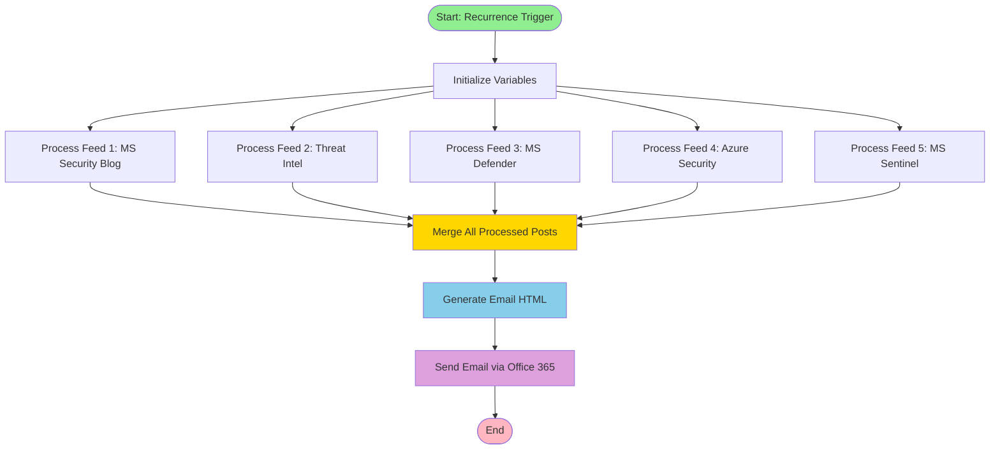
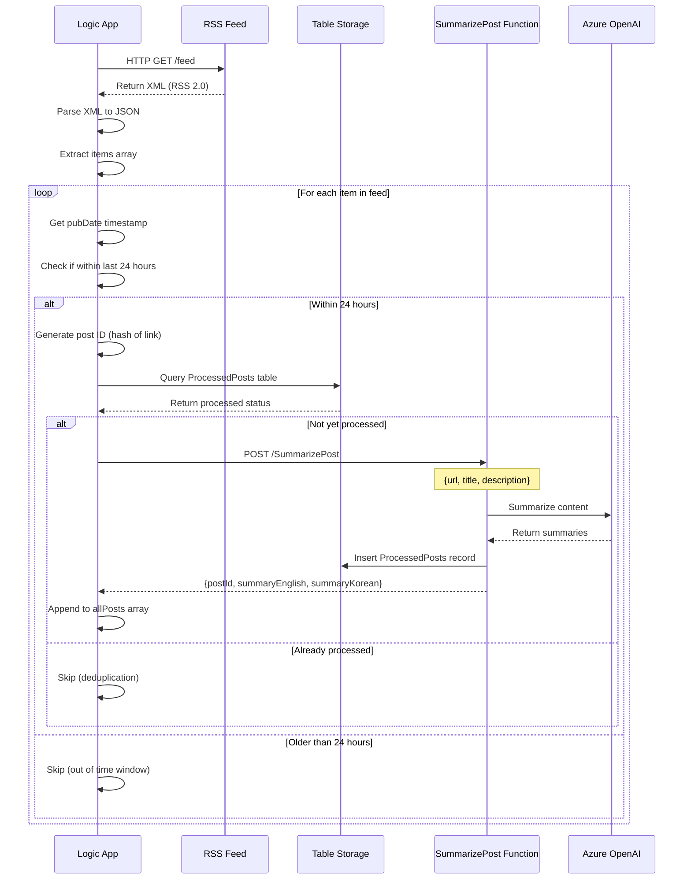
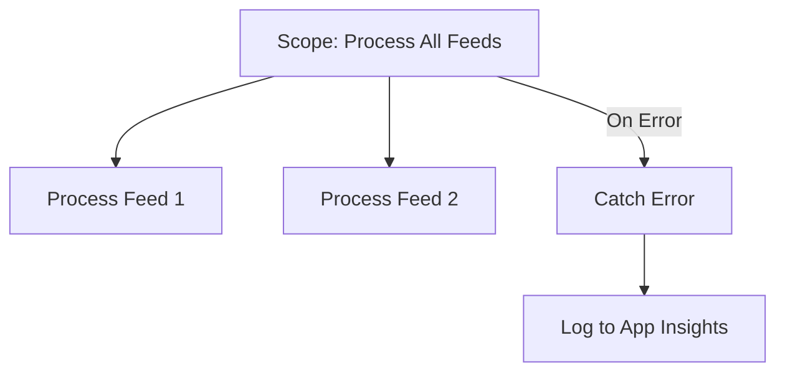

# Logic App Workflow Deep Dive

## Workflow Overview

The Logic App workflow orchestrates the entire blog post aggregation, summarization, and email distribution process. It runs on a fixed schedule (07:00, 15:00, 22:00 KST) and processes 5 different Microsoft security blog RSS feeds.

## Workflow Execution Flow



## Detailed Step-by-Step Breakdown

### 1. Recurrence Trigger

**Trigger Type**: Schedule

**Configuration**:
```json
{
  "recurrence": {
    "frequency": "Hour",
    "interval": 1,
    "schedule": {
      "hours": [7, 15, 22]
    },
    "timeZone": "Korea Standard Time"
  }
}
```

**Behavior**:
- Runs exactly at 07:00, 15:00, and 22:00 Korea Standard Time (UTC+9)
- Automatic retry on failure (configured in Logic App settings)
- Run history tracked for 90 days

### 2. Initialize Variables

**Purpose**: Set up variables to store post data throughout workflow execution

**Variables**:

| Variable Name | Type | Purpose | Initial Value |
|---------------|------|---------|---------------|
| `allPosts` | Array | Stores all summarized posts from all feeds | `[]` |
| `currentTime` | String | Captures workflow start time | `utcNow()` |
| `processedCount` | Integer | Counts total processed posts | `0` |

**Code**:
```json
{
  "Initialize_allPosts": {
    "type": "InitializeVariable",
    "inputs": {
      "variables": [{
        "name": "allPosts",
        "type": "array",
        "value": []
      }]
    }
  }
}
```

### 3. RSS Feed Processing (Parallel Execution)

Each of the 5 RSS feeds is processed in parallel using identical logic. The feeds are:

#### Feed 1: 🔒 Microsoft Security Blog
- **URL**: `https://www.microsoft.com/en-us/security/blog/feed/`
- **Content**: General security topics, announcements, best practices
- **Volume**: ~3-5 posts/day

#### Feed 2: 🔍 MS Security - Threat Intelligence
- **URL**: `https://www.microsoft.com/en-us/security/blog/topic/threat-intelligence/feed/`
- **Content**: Threat analysis, APT reports, vulnerability disclosures
- **Volume**: ~1-2 posts/day

#### Feed 3: 🛡️ Microsoft Defender TechCommunity
- **URL**: `https://techcommunity.microsoft.com/plugins/custom/microsoft/o365/custom-blog-rss?board=MicrosoftDefenderATPBlog`
- **Content**: Defender product updates, threat hunting, detection engineering
- **Volume**: ~2-3 posts/week

#### Feed 4: ☁️ Azure Security Blog
- **URL**: `https://azure.microsoft.com/en-us/blog/topics/security/feed/`
- **Content**: Azure security features, compliance, architecture
- **Volume**: ~2-4 posts/week

#### Feed 5: 👁️ Microsoft Sentinel TechCommunity
- **URL**: `https://techcommunity.microsoft.com/plugins/custom/microsoft/o365/custom-blog-rss?board=MicrosoftSentinelBlog`
- **Content**: Sentinel features, detection rules, SIEM best practices
- **Volume**: ~2-3 posts/week

### Feed Processing Logic (Per Feed)



#### Step 3.1: Fetch RSS Feed

**Action Type**: HTTP

**Configuration**:
```json
{
  "method": "GET",
  "uri": "https://www.microsoft.com/en-us/security/blog/feed/",
  "headers": {
    "Accept": "application/xml"
  }
}
```

**Response Example**:
```xml
<?xml version="1.0" encoding="UTF-8"?>
<rss version="2.0">
  <channel>
    <title>Microsoft Security Blog</title>
    <item>
      <title>New threat actor targets healthcare sector</title>
      <link>https://www.microsoft.com/security/blog/2024/01/15/new-threat-actor/</link>
      <pubDate>Mon, 15 Jan 2024 14:30:00 +0000</pubDate>
      <description>Microsoft Threat Intelligence has identified...</description>
    </item>
  </channel>
</rss>
```

#### Step 3.2: Parse XML

**Action Type**: Built-in XML Parser

**Expression**: `xml(body('HTTP_Get_RSS_Feed'))`

**Output**: JSON representation of RSS feed

```json
{
  "rss": {
    "channel": {
      "title": "Microsoft Security Blog",
      "item": [
        {
          "title": "New threat actor targets healthcare sector",
          "link": "https://...",
          "pubDate": "Mon, 15 Jan 2024 14:30:00 +0000",
          "description": "Microsoft Threat Intelligence has identified..."
        }
      ]
    }
  }
}
```

#### Step 3.3: Filter Posts by Date

**Action Type**: Filter Array

**Filter Expression**:
```
@greater(
  formatDateTime(items('For_each_post')?['pubDate'], 'yyyy-MM-ddTHH:mm:ss'),
  addDays(utcNow(), -1, 'yyyy-MM-ddTHH:mm:ss')
)
```

**Logic**:
- Parse `pubDate` from RSS item
- Convert to ISO 8601 format
- Compare with current time minus 24 hours
- Only process posts published within last 24 hours

#### Step 3.4: Generate Post ID

**Expression**:
```
@concat(
  'Post_',
  replace(
    replace(items('For_each_post')?['link'], 'https://', ''),
    '/', '_'
  )
)
```

**Example**:
- Input: `https://www.microsoft.com/security/blog/2024/01/15/new-threat-actor/`
- Output: `Post_www.microsoft.com_security_blog_2024_01_15_new-threat-actor_`

#### Step 3.5: Check if Post Already Processed

**Action Type**: Azure Table Storage - Get Entity

**Parameters**:
```json
{
  "storageAccount": "stdevsecurityblog",
  "tableName": "ProcessedPosts",
  "partitionKey": "@{variables('feedName')}",
  "rowKey": "@{variables('postId')}"
}
```

**Outcomes**:
- **Entity Found**: Skip post (already processed)
- **Entity Not Found**: Proceed to summarization

#### Step 3.6: Call SummarizePost Function

**Action Type**: HTTP POST

**Endpoint**: `https://func-dev-security-blog-automation.azurewebsites.net/api/SummarizePost?code=<function-key>`

**Request Body**:
```json
{
  "url": "@{items('For_each_post')?['link']}",
  "title": "@{items('For_each_post')?['title']}",
  "description": "@{items('For_each_post')?['description']}",
  "feedName": "@{variables('feedName')}",
  "postId": "@{variables('postId')}"
}
```

**Response**:
```json
{
  "postId": "Post_www.microsoft.com_security_blog_...",
  "summaryEnglish": "Microsoft Threat Intelligence discovered a new APT group...",
  "summaryKorean": "마이크로소프트 위협 인텔리전스 팀이 의료 부문을 타겟으로 하는...",
  "isProcessed": true,
  "feedName": "MS Security Blog"
}
```

**Error Handling**:
- **Retry Policy**: 3 attempts with exponential backoff
- **Timeout**: 5 minutes
- **Failure Action**: Log error to Application Insights, continue with next post

#### Step 3.7: Append to Results Array

**Action Type**: Append to Array Variable

**Expression**:
```json
{
  "title": "@{items('For_each_post')?['title']}",
  "link": "@{items('For_each_post')?['link']}",
  "pubDate": "@{items('For_each_post')?['pubDate']}",
  "feedName": "@{variables('feedName')}",
  "summaryEnglish": "@{body('SummarizePost')?['summaryEnglish']}",
  "summaryKorean": "@{body('SummarizePost')?['summaryKorean']}"
}
```

### 4. Merge All Posts

**Action Type**: Compose

**Purpose**: Consolidate all posts from all 5 feeds into a single array

**Expression**:
```
@union(
  variables('feed1Posts'),
  variables('feed2Posts'),
  variables('feed3Posts'),
  variables('feed4Posts'),
  variables('feed5Posts')
)
```

**Output Schema**:
```json
[
  {
    "title": "New threat actor targets healthcare sector",
    "link": "https://...",
    "pubDate": "2024-01-15T14:30:00Z",
    "feedName": "🔒 MS Security Blog",
    "summaryEnglish": "Microsoft Threat Intelligence discovered...",
    "summaryKorean": "마이크로소프트 위협 인텔리전스 팀이..."
  },
  {
    "title": "Azure Sentinel detection rules updated",
    "link": "https://...",
    "feedName": "👁️ MS Sentinel",
    "summaryEnglish": "New detection rules for...",
    "summaryKorean": "새로운 탐지 규칙이..."
  }
]
```

### 5. Generate Email HTML

**Action Type**: HTTP POST to Azure Function

**Endpoint**: `https://func-dev-security-blog-automation.azurewebsites.net/api/GenerateEmailHtml?code=<function-key>`

**Request Body**:
```json
{
  "posts": "@{body('Merge_All_Posts')}"
}
```

**Response**:
```json
{
  "subject": "[Microsoft Azure 업데이트] 최근 게시글 요약 (신규 5개)",
  "htmlBody": "<!DOCTYPE html><html>...</html>",
  "postCount": 5,
  "hasNewPosts": true
}
```

**Function Logic** (see `functions/GenerateEmailHtml.cs`):
1. Count actual new posts (excluding "No new posts" placeholders)
2. Generate subject line:
   - If `postCount > 0`: `[Microsoft Azure 업데이트] 최근 게시글 요약 (신규 X개)`
   - If `postCount == 0`: `[Microsoft Azure 업데이트] 최근 게시글 요약 (신규 없음)`
3. Generate HTML email body:
   - Header with date and post count
   - Group posts by feed
   - Display title, publication date, summaries (English + Korean)
   - Footer with disclaimer and links

### 6. Send Email (Office 365)

**Action Type**: Office 365 Outlook - Send an email (V2)

**Configuration**:
```json
{
  "To": "recipient@domain.com",
  "Subject": "@{body('GenerateEmailHtml')?['subject']}",
  "Body": "@{body('GenerateEmailHtml')?['htmlBody']}",
  "Importance": "Normal",
  "IsHtml": true
}
```

**Authentication**: OAuth 2.0 with Office 365 account

**Error Handling**:
- **Retry Policy**: 2 attempts with 5-minute interval
- **Failure Action**: Send notification email to admin (fallback)

**Rate Limits**:
- Office 365: 30 emails/minute (well within limits for this workflow)

## Workflow Variables & Expressions

### Key Variables

| Variable | Type | Scope | Purpose |
|----------|------|-------|---------|
| `allPosts` | Array | Workflow | Stores all summarized posts |
| `feedName` | String | Loop | Current feed being processed |
| `postId` | String | Loop | Unique post identifier |
| `currentPost` | Object | Loop | Current post being processed |
| `processedCount` | Integer | Workflow | Total posts processed |

### Common Expressions

#### Get Current Timestamp (UTC)
```
@utcNow()
```

#### Format Date
```
@formatDateTime(utcNow(), 'yyyy-MM-dd HH:mm:ss')
```

#### Convert Time Zone
```
@convertTimeZone(utcNow(), 'UTC', 'Korea Standard Time', 'yyyy-MM-dd HH:mm:ss')
```

#### Add Days to Date
```
@addDays(utcNow(), -1)
```

#### Substring Extraction
```
@substring(variables('postUrl'), 0, 50)
```

#### Conditional Expression
```
@if(greater(variables('postCount'), 0), 'Has posts', 'No posts')
```

#### Array Length
```
@length(variables('allPosts'))
```

## Error Handling & Retry Logic

### Retry Configuration

All HTTP actions (RSS fetch, Function calls) have retry policies:

```json
{
  "retryPolicy": {
    "type": "exponential",
    "count": 3,
    "interval": "PT10S",
    "minimumInterval": "PT5S",
    "maximumInterval": "PT1H"
  }
}
```

- **Type**: Exponential backoff
- **Attempts**: 3
- **Initial Interval**: 10 seconds
- **Min Interval**: 5 seconds
- **Max Interval**: 1 hour

### Error Scopes

The workflow uses **Scope** actions to group related actions and handle errors:



**Configuration**:
```json
{
  "Scope_ProcessFeeds": {
    "type": "Scope",
    "actions": {
      "ProcessFeed1": {...},
      "ProcessFeed2": {...}
    },
    "runAfter": {},
    "catch": {
      "actions": {
        "LogError": {
          "type": "Compose",
          "inputs": "@result('Scope_ProcessFeeds')"
        }
      }
    }
  }
}
```

### Failure Notifications

If critical errors occur, the workflow sends an admin notification:

**Condition**: `@equals(outputs('Send_Email')?['statusCode'], 400)`

**Action**: Send fallback email with error details

## Performance Optimization

### Parallel Execution

The 5 RSS feeds are processed in parallel, not sequentially:

**Sequential Time**: ~5 minutes (1 min/feed × 5 feeds)  
**Parallel Time**: ~1 minute (max of all feeds)

**Configuration**:
```json
{
  "forEach": "@variables('feedUrls')",
  "actions": {...},
  "runtimeConfiguration": {
    "concurrency": {
      "repetitions": 5
    }
  }
}
```

### Caching & Deduplication

**Table Storage Query Optimization**:
- Partition by feed name (limits scan to single partition)
- Row key is post ID hash (direct entity lookup, O(1) complexity)

**Expected Query Time**: <50ms per post

### Function Timeout

Azure Functions have 5-minute default timeout, but typical execution:
- **SummarizePost**: 5-15 seconds (depends on Azure OpenAI latency)
- **GenerateEmailHtml**: <1 second (template generation only)

## Monitoring & Diagnostics

### Run History

Logic Apps store full run history including:
- Start/End time
- Duration
- Status (Succeeded, Failed, Cancelled)
- Inputs/Outputs for each action
- Error messages and stack traces

**Retention**: 90 days

### Application Insights Integration

All actions are traced in Application Insights:

**Custom Events**:
- `FeedProcessed`: Feed name, post count, duration
- `PostSummarized`: Post ID, feed, Azure OpenAI tokens used
- `EmailSent`: Recipient, post count, email size

**Queries**:
```kusto
// Average posts per feed
customEvents
| where name == "FeedProcessed"
| summarize AvgPosts = avg(toint(customDimensions.postCount)) by tostring(customDimensions.feedName)

// Email send failures
traces
| where message contains "Send_Email" and severityLevel > 2
| project timestamp, message, severityLevel
```

### Alerting Rules

Recommended alerts:

| Alert | Condition | Severity |
|-------|-----------|----------|
| Workflow Failure | 3 consecutive failures | High |
| High Latency | Duration > 10 minutes | Medium |
| Zero Posts for 3 Days | No new posts for 72 hours | Low |
| Azure OpenAI Throttling | 429 errors > 5/hour | High |

## Workflow Customization

### Adding New RSS Feeds

1. **Duplicate Feed Processing Block**:
   - Copy existing "Process Feed 1" scope
   - Rename to "Process Feed 6"

2. **Update Feed URL**:
   ```json
   {
     "uri": "https://new-feed-url.com/feed/"
   }
   ```

3. **Update Feed Name Variable**:
   ```json
   {
     "feedName": "🔐 New Security Feed"
   }
   ```

4. **Add to Merge Action**:
   ```
   @union(variables('feed1Posts'), ..., variables('feed6Posts'))
   ```

### Changing Email Recipients

Update Office 365 action:

```json
{
  "To": "team@company.com",
  "Cc": "manager@company.com",
  "Bcc": "archive@company.com"
}
```

### Customizing Summarization Prompt

Modify in `functions/SummarizePost.cs`:

```csharp
var systemPrompt = @"
You are a cybersecurity expert. Summarize the following blog post in 2-3 sentences.
Focus on:
1. Main threat or vulnerability
2. Impact on organizations
3. Recommended actions

Keep summaries concise and actionable.
";
```

### Changing Schedule

**Example: Only weekdays at 09:00**:

```json
{
  "recurrence": {
    "frequency": "Week",
    "interval": 1,
    "schedule": {
      "hours": [9],
      "weekDays": ["Monday", "Tuesday", "Wednesday", "Thursday", "Friday"]
    }
  }
}
```

## Security Considerations

### API Key Management

**Current Approach**: Function keys in Logic App HTTP action URIs

**Best Practice**: Use Managed Identity

```json
{
  "authentication": {
    "type": "ManagedServiceIdentity",
    "audience": "https://func-dev-security-blog-automation.azurewebsites.net"
  }
}
```

### Data Privacy

- **No PII**: Workflow does not process personal data
- **Public RSS Feeds**: All sources are public Microsoft blogs
- **Email Content**: Contains only summaries, no user-generated content

### Connection Security

All connections use OAuth 2.0 or Managed Identity:
- ✅ Office 365: OAuth with consent
- ✅ Azure Table Storage: Connection string (rotating keys recommended)
- ✅ Azure Functions: Function keys (consider Managed Identity)

## Troubleshooting Common Issues

### Issue 1: Email Shows "0 Posts" But Posts Exist

**Cause**: `GenerateEmailHtml` counts `actualNewPostsCount` incorrectly

**Solution**: Check `functions/GenerateEmailHtml.cs` logic:
```csharp
var actualNewPostsCount = feedGroups.Sum(g => 
    g.Posts.Count(p => !p.Title.Contains("No new posts"))
);
```

### Issue 2: Duplicate Posts in Email

**Cause**: Table Storage deduplication not working

**Solution**: Verify post ID generation is consistent across runs

### Issue 3: Azure OpenAI Timeout

**Cause**: GPT-4o model throttling or long article content

**Solution**:
- Increase Azure OpenAI quota
- Reduce article content length in `SummarizePost.cs`
- Implement retry with exponential backoff

### Issue 4: RSS Feed Parse Error

**Cause**: Malformed XML or unexpected RSS schema

**Solution**: Add XML validation and fallback:
```json
{
  "Try": {
    "actions": {
      "ParseXML": {...}
    }
  },
  "Catch": {
    "actions": {
      "LogError": {...},
      "UseDefaultPosts": {...}
    }
  }
}
```

## Advanced Topics

### State Management

Logic Apps are stateless by design, but workflow variables persist during a single run:

- **Workflow Variables**: Reset on each run
- **Table Storage**: Persists across runs (deduplication state)
- **Application Insights**: Audit trail for historical analysis

### Workflow Versioning

Best practices:
1. Export workflow definition to Git after each change
2. Tag versions: `v1.0.0`, `v1.1.0`, etc.
3. Keep `workflow-full.json` in sync with deployed version

### Cost Optimization

**Current Costs** (approximate):
- Logic App Standard: ~$200/month (WS1 tier)
- Azure Functions: ~$0 (Consumption, minimal usage)
- Azure OpenAI: ~$10-50/month (depends on post volume)
- Table Storage: ~$0.10/month

**Total**: ~$210-250/month

**Optimization Tips**:
- Use Logic App Consumption tier (pay-per-execution) if < 1000 runs/month
- Cache summaries in Table Storage (avoid re-summarizing same posts)
- Use GPT-4o-mini instead of GPT-4o (50% cost reduction)

## Workflow Definition File

The complete workflow definition is stored in:

**File**: `/infra/logic-app/workflow-full.json`

**Usage**:
- Import into Logic App via Azure Portal
- Deploy via ARM template
- Version control in Git

**Key Sections**:
- `definition.triggers`: Recurrence configuration
- `definition.actions`: All workflow steps
- `definition.outputs`: Workflow results
- `parameters`: Parameterized values (connections, keys)

## References

- [Azure Logic Apps Workflow Definition Language](https://learn.microsoft.com/en-us/azure/logic-apps/logic-apps-workflow-definition-language)
- [Logic Apps Expressions Reference](https://learn.microsoft.com/en-us/azure/logic-apps/workflow-definition-language-functions-reference)
- [RSS 2.0 Specification](https://www.rssboard.org/rss-specification)
- [Office 365 Connector Documentation](https://learn.microsoft.com/en-us/connectors/office365/)
