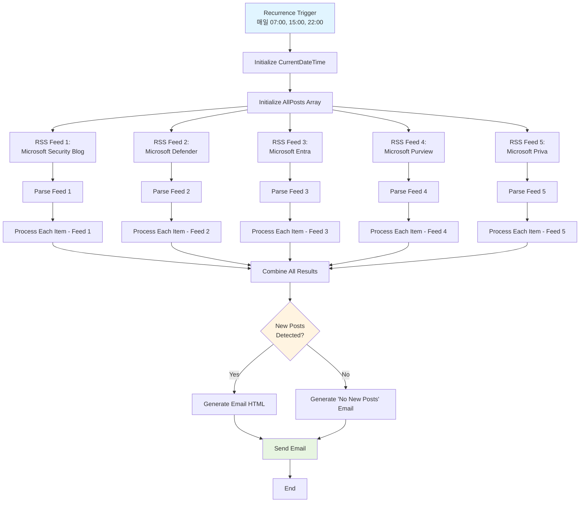

# Logic App 워크플로우 상세 가이드

## 개요

이 문서는 **Azure Security Blog Automation** 솔루션의 핵심인 Logic App (Standard) 워크플로우에 대한 상세 분석을 제공합니다. 워크플로우는 Microsoft 보안 블로그에서 RSS 피드를 가져와 새로운 게시글을 감지하고, AI로 요약을 생성하며, 형식이 지정된 이메일 알림을 발송합니다.

## 워크플로우 실행 흐름



## 주요 단계 상세 설명

### 1. Recurrence 트리거

**목적**: 특정 시간에 워크플로우를 자동으로 실행합니다.

**구성**:
- **빈도**: Hour (매시간)
- **간격**: 1
- **시간대**: (UTC+09:00) Seoul
- **이 시간에**: 7, 15, 22 (07:00, 15:00, 22:00에만 실행)

**동작**:
- Logic App은 매일 3번 (07:00, 15:00, 22:00 KST) 실행됩니다.
- 각 실행은 독립적이며 이전 실행의 상태에 영향을 받지 않습니다.

**커스터마이징**:
```json
{
  "recurrence": {
    "frequency": "Day",
    "interval": 1,
    "schedule": {
      "hours": ["9"],
      "minutes": [0]
    },
    "timeZone": "Korea Standard Time"
  }
}
```
하루에 한 번 (09:00)으로 변경하려면 위 구성을 사용하세요.

### 2. 변수 초기화

#### 2.1 Initialize CurrentDateTime

**목적**: 워크플로우 실행 시작 시간을 캡처합니다.

**타입**: String

**값**: 
```
@{utcNow()}
```

**사용**:
- 로깅 및 디버깅
- 이메일 헤더의 타임스탬프
- 처리된 게시글을 Table Storage에 저장할 때 ProcessedDate 필드

#### 2.2 Initialize AllPosts

**목적**: 모든 RSS 피드의 게시글을 누적합니다.

**타입**: Array

**초기값**: `[]` (빈 배열)

**구조**: 각 항목은 다음을 포함합니다:
```json
{
  "feedName": "🛡️ Microsoft Security Blog",
  "title": "Announcing new AI-powered security capabilities",
  "link": "https://www.microsoft.com/security/blog/...",
  "publishDate": "2024-01-15T10:30:00Z",
  "description": "Original article description...",
  "summaryEnglish": "AI-generated summary in English...",
  "summaryKorean": "AI가 생성한 한국어 요약...",
  "isNew": true
}
```

### 3. RSS 피드 가져오기

워크플로우는 5개의 RSS 피드를 병렬로 가져옵니다:

#### 피드 1: 🛡️ Microsoft Security Blog
- **URL**: `https://www.microsoft.com/en-us/security/blog/feed/`
- **내용**: 일반 보안 공지, 위협 인텔리전스, 모범 사례

#### 피드 2: 🔒 Microsoft Defender
- **URL**: `https://techcommunity.microsoft.com/plugins/custom/microsoft/o365/custom-blog-rss?board=MicrosoftDefenderBlog`
- **내용**: Microsoft Defender 제품 (Endpoint, Cloud Apps, Identity, Vulnerability Management)

#### 피드 3: 🔑 Microsoft Entra (Azure AD)
- **URL**: `https://techcommunity.microsoft.com/plugins/custom/microsoft/o365/custom-blog-rss?board=Identity`
- **내용**: Azure AD / Microsoft Entra, IAM, 조건부 액세스

#### 피드 4: 🗂️ Microsoft Purview
- **URL**: `https://techcommunity.microsoft.com/plugins/custom/microsoft/o365/custom-blog-rss?board=MicrosoftPurviewBlog`
- **내용**: 데이터 거버넌스, 컴플라이언스, DLP

#### 피드 5: 🔐 Microsoft Priva
- **URL**: `https://techcommunity.microsoft.com/plugins/custom/microsoft/o365/custom-blog-rss?board=MicrosoftPrivaBlog`
- **내용**: 개인정보 보호 관리, GDPR, 데이터 주체 권리

**동작**:
- 각 RSS 액션은 최근 게시글을 XML 형식으로 가져옵니다.
- 출력은 `items` 배열에 저장됩니다 (각 항목: title, link, publishDate, description).

### 4. RSS 피드 파싱

각 RSS 피드는 파싱되어 표준화된 JSON으로 변환됩니다.

**입력**: RSS 액션의 원시 출력 (XML)

**출력**: 다음 속성을 가진 배열:
```json
[
  {
    "title": "Article Title",
    "link": "https://...",
    "publishDate": "2024-01-15T10:30:00Z",
    "description": "Short description"
  }
]
```

**Logic App 표현식**:
```
@body('List_all_RSS_feed_items_-_Feed_1')?['items']
```

### 5. 각 게시글 처리 (For Each 루프)

각 RSS 피드에 대해 **For Each** 루프가 개별 게시글을 처리합니다.

#### 5.1 중복 체크 (Table Storage 조회)

**목적**: 이전에 처리된 게시글을 건너뜁니다.

**동작**:
1. 게시글 링크에서 고유 ID 생성 (해시 또는 추출)
2. Table Storage에서 기존 항목 조회:
   - **테이블 이름**: `ProcessedPosts`
   - **PartitionKey**: `SecurityBlog`
   - **RowKey**: `{postId}` (게시글의 고유 식별자)

3. 결과에 따라:
   - **발견됨**: `isNew = false`로 설정, 처리 건너뛰기
   - **발견 안 됨**: `isNew = true`로 설정, 계속 진행

**Logic App Condition**:
```json
{
  "expression": {
    "and": [
      {
        "equals": [
          "@outputs('Get_Entity_-_Check_if_Processed')?['statusCode']",
          404
        ]
      }
    ]
  },
  "type": "If"
}
```

#### 5.2 Azure Functions 호출 (요약 생성)

**조건**: `isNew = true`인 경우에만 실행됩니다.

**Function**: `SummarizePost`

**입력 페이로드**:
```json
{
  "url": "@{items('For_Each_Item_-_Feed_1')?['link']}",
  "title": "@{items('For_Each_Item_-_Feed_1')?['title']}",
  "description": "@{items('For_Each_Item_-_Feed_1')?['description']}"
}
```

**Function 동작**:
1. Azure OpenAI GPT-4o를 사용하여 게시글 요약 생성
2. 영어 및 한국어로 요약 생성
3. Table Storage에 결과 저장:
   - **PartitionKey**: `SecurityBlog`
   - **RowKey**: `{postId}`
   - **Title**: 게시글 제목
   - **Url**: 게시글 링크
   - **SummaryEnglish**: 영어 요약
   - **SummaryKorean**: 한국어 요약
   - **ProcessedDate**: 처리 날짜 (ISO 8601)
   - **IsProcessed**: `true`

**Function 출력**:
```json
{
  "postId": "abc123def456",
  "summaryEnglish": "Summary in English...",
  "summaryKorean": "한국어 요약...",
  "isProcessed": true
}
```

#### 5.3 AllPosts 배열에 추가

**동작**: Function 호출 후, 게시글 세부 정보를 `AllPosts` 배열에 추가합니다.

**추가되는 객체**:
```json
{
  "feedName": "🛡️ Microsoft Security Blog",
  "title": "@{items('For_Each_Item_-_Feed_1')?['title']}",
  "link": "@{items('For_Each_Item_-_Feed_1')?['link']}",
  "publishDate": "@{items('For_Each_Item_-_Feed_1')?['publishDate']}",
  "description": "@{items('For_Each_Item_-_Feed_1')?['description']}",
  "summaryEnglish": "@{body('SummarizePost_HTTP')?['summaryEnglish']}",
  "summaryKorean": "@{body('SummarizePost_HTTP')?['summaryKorean']}",
  "isNew": true
}
```

**Logic App 액션**:
```json
{
  "Append_to_Array_-_Add_to_AllPosts": {
    "type": "AppendToArrayVariable",
    "inputs": {
      "name": "AllPosts",
      "value": { ... }
    }
  }
}
```

### 6. 모든 결과 결합

5개의 RSS 피드가 모두 처리되면, `AllPosts` 배열에 다음이 포함됩니다:
- 새로운 게시글 (요약 포함, `isNew = true`)
- 이전에 처리된 게시글 (`isNew = false`)

**다음 단계**:
- 이메일 본문 생성 시 `isNew = true`인 항목만 포함

### 7. 이메일 HTML 생성

#### 7.1 새 게시글이 있는 경우

**조건**:
```
@greater(length(variables('AllPosts')), 0)
```

**동작**: `GenerateEmailHtml` Azure Function 호출

**입력**:
```json
{
  "posts": "@variables('AllPosts')",
  "currentDateTime": "@variables('CurrentDateTime')"
}
```

**Function 동작**:
1. 게시글을 `feedName`별로 그룹화
2. HTML 템플릿 생성:
   - 헤더 (날짜, 새 게시글 개수)
   - 피드별 섹션
   - 각 게시글:
     - 제목 (링크 포함)
     - 발행일
     - 영어 요약
     - 한국어 요약
   - 푸터 (링크, 저작권)

**출력 (샘플)**:
```html
<!DOCTYPE html>
<html>
<head>
  <style>
    body { font-family: 'Segoe UI', Tahoma, Geneva, Verdana, sans-serif; }
    .header { background: linear-gradient(135deg, #0078D4 0%, #005A9E 100%); color: white; padding: 30px; }
    .feed-section { margin: 20px 0; }
    .post-item { border-left: 4px solid #0078D4; padding-left: 15px; margin: 15px 0; }
  </style>
</head>
<body>
  <div class="header">
    <h1>Microsoft Azure Security Updates</h1>
    <p>2024년 1월 15일 | 새로운 게시글 5개</p>
  </div>
  
  <div class="feed-section">
    <h2>🛡️ Microsoft Security Blog</h2>
    
    <div class="post-item">
      <h3><a href="https://...">Announcing new AI-powered security capabilities</a></h3>
      <p><em>발행일: 2024-01-15</em></p>
      <p><strong>Summary:</strong> Microsoft announces new AI-powered...</p>
      <p><strong>요약:</strong> Microsoft가 새로운 AI 기반...</p>
    </div>
  </div>
  
  <div class="footer">
    <p>Powered by Azure Logic Apps | <a href="https://github.com/...">GitHub</a></p>
  </div>
</body>
</html>
```

#### 7.2 새 게시글이 없는 경우

**조건**:
```
@equals(length(variables('AllPosts')), 0)
```

**동작**: 간단한 "신규 게시글 없음" HTML 생성

**출력**:
```html
<!DOCTYPE html>
<html>
<body>
  <h2>Microsoft Azure Security Updates</h2>
  <p>2024년 1월 15일 07:00 기준, 새로운 게시글이 없습니다.</p>
  <p>다음 업데이트: 15:00</p>
</body>
</html>
```

### 8. 이메일 발송

**액션**: `Send_an_email_(V2)` (Office 365 Connector)

**입력**:
- **받는 사람**: 구성된 수신자 이메일 주소
- **제목**: 
  - **새 게시글 있음**: `[Microsoft Azure 업데이트] 최근 게시글 요약 (신규 @{length(variables('AllPosts'))}개)`
  - **새 게시글 없음**: `[Microsoft Azure 업데이트] 최근 게시글 요약 (신규 없음)`
- **본문**: `@{body('GenerateEmailHtml_HTTP')}`
- **중요도**: Normal
- **Content-Type**: HTML

**동작**:
1. Office 365 연결을 사용하여 인증
2. 구성된 수신자에게 HTML 이메일 발송
3. 성공/실패 상태 반환

## 오류 처리

### HTTP 액션 재시도 정책

모든 HTTP 액션 (Azure Functions 호출)은 다음과 같은 재시도 정책을 사용합니다:

```json
{
  "retryPolicy": {
    "type": "exponential",
    "count": 3,
    "interval": "PT10S",
    "minimumInterval": "PT5S",
    "maximumInterval": "PT1M"
  }
}
```

**동작**:
- **재시도 횟수**: 3회
- **초기 간격**: 10초
- **지수 백오프**: 각 재시도마다 간격 증가
- **최대 간격**: 1분

### Scope 액션 (오류 그룹화)

워크플로우는 **Scope** 액션을 사용하여 관련 액션을 그룹화하고 오류를 처리합니다.

**예시**:
```json
{
  "Scope_Process_Feed_1": {
    "type": "Scope",
    "actions": {
      "List_RSS_Feed_1": { ... },
      "For_Each_Item_Feed_1": { ... }
    },
    "runAfter": {}
  }
}
```

**오류 처리**:
- Scope 실패 시 워크플로우가 계속 진행됩니다 (다른 피드는 영향 받지 않음).
- 실행 기록에서 실패한 Scope 확인 가능.

### Table Storage 오류

**시나리오**: Table Storage 쓰기 실패 (예: 네트워크 문제)

**동작**:
- Function은 오류를 로깅하고 계속 진행합니다.
- 게시글은 다음 실행에서 재처리됩니다 (중복 체크 실패로 인해).

**완화 방법**:
- Application Insights에서 오류 모니터링
- 중요한 실패에 대한 경고 설정

## 커스터마이징 가이드

### RSS 피드 추가

**단계**:

1. **새 RSS 액션 추가**:
   ```json
   {
     "List_all_RSS_feed_items_-_Feed_6": {
       "type": "ApiConnection",
       "inputs": {
         "host": {
           "connection": {
             "name": "@parameters('$connections')['rss']['connectionId']"
           }
         },
         "method": "get",
         "path": "/ListFeedItems",
         "queries": {
           "feedUrl": "https://new-feed-url.com/rss"
         }
       }
     }
   }
   ```

2. **Parse 액션 추가**:
   ```json
   {
     "Parse_Feed_6": {
       "type": "Compose",
       "inputs": "@body('List_all_RSS_feed_items_-_Feed_6')?['items']",
       "runAfter": {
         "List_all_RSS_feed_items_-_Feed_6": ["Succeeded"]
       }
     }
   }
   ```

3. **For Each 루프 추가**:
   - 기존 루프 복제
   - 피드 이름 업데이트: `feedName: "🆕 New Feed Name"`
   - AllPosts에 추가

4. **워크플로우 저장 및 테스트**

### 요약 프롬프트 변경

`functions/SummarizePost.cs`에서 수정:

```csharp
private static string GetSummaryPrompt(string title, string description)
{
    return $@"
You are a technical writer specializing in cloud security.

Summarize the following article in 2-3 sentences:
- Title: {title}
- Description: {description}

Requirements:
- Focus on key technical points
- Highlight security implications
- Mention affected products/services
- Keep it concise and actionable

Provide two versions:
1. English summary
2. Korean summary (한국어 요약)
";
}
```

**커스터마이징 옵션**:
- 요약 길이 변경 (2-3 문장 → 4-5 문장)
- 톤 조정 (기술적 → 비즈니스 중심)
- 추가 언어 (일본어, 중국어 등)

### 이메일 템플릿 수정

`functions/GenerateEmailHtml.cs`에서 HTML 템플릿 커스터마이징:

```csharp
private static string GetEmailTemplate(string headerContent, string bodyContent)
{
    return $@"
<!DOCTYPE html>
<html>
<head>
    <style>
        /* CSS 스타일 커스터마이징 */
        body {{ 
            font-family: 'Segoe UI', sans-serif; 
            background-color: #f5f5f5;
        }}
        .header {{ 
            background: linear-gradient(135deg, #0078D4 0%, #005A9E 100%);
            color: white;
            padding: 30px;
        }}
        /* 추가 스타일... */
    </style>
</head>
<body>
    {headerContent}
    {bodyContent}
    <div class='footer'>
        <p>Powered by Azure | <a href='https://...'>Unsubscribe</a></p>
    </div>
</body>
</html>
";
}
```

**변경 가능 항목**:
- 색상 스키마
- 폰트 및 크기
- 레이아웃 (단일 열 → 다중 열)
- 푸터 링크 (구독 취소, 환경 설정 등)

### 스케줄 변경

Logic App Designer 또는 JSON 코드에서:

```json
{
  "triggers": {
    "Recurrence": {
      "recurrence": {
        "frequency": "Day",
        "interval": 1,
        "schedule": {
          "hours": ["9", "17"],
          "minutes": [0]
        },
        "timeZone": "Korea Standard Time"
      },
      "type": "Recurrence"
    }
  }
}
```

**일반적인 스케줄**:
- **하루 1회**: `hours: ["9"]`
- **업무 시간**: `hours: ["9", "12", "15", "18"]`
- **매시간**: `frequency: "Hour", interval: 1` (hours 제거)

## 모니터링 및 로깅

### Logic App 실행 기록

1. Azure Portal → Logic App → 개요
2. **실행 기록** 테이블 확인:
   - **시작 시간**: 워크플로우 실행 시작 시간
   - **기간**: 총 실행 시간
   - **상태**: 성공, 실패, 취소됨
   - **트리거**: Recurrence

3. **실행 클릭**하여 상세 보기:
   - 각 액션의 입력/출력
   - 실행 시간
   - 오류 메시지 (실패한 경우)

### Application Insights 쿼리

#### Function 호출 추적

```kusto
requests
| where timestamp > ago(24h)
| where name in ("SummarizePost", "GenerateEmailHtml")
| project timestamp, name, duration, resultCode, customDimensions
| order by timestamp desc
```

#### 오류 추적

```kusto
exceptions
| where timestamp > ago(24h)
| where cloud_RoleName == "func-dev-security-blog-automation"
| project timestamp, type, outerMessage, innerMessage, problemId
| order by timestamp desc
```

#### Azure OpenAI 호출 성능

```kusto
dependencies
| where timestamp > ago(24h)
| where type == "HTTP"
| where target contains "openai.azure.com"
| summarize 
    Count = count(), 
    AvgDuration = avg(duration), 
    MaxDuration = max(duration)
    by bin(timestamp, 1h)
| render timechart
```

### 경고 설정

#### Logic App 실패 경고

```bash
az monitor metrics alert create \
  --name "LogicApp-FailureAlert" \
  --resource-group rg-security-blog-automation-dev \
  --scopes "/subscriptions/<subscription-id>/resourceGroups/rg-security-blog-automation-dev/providers/Microsoft.Logic/workflows/logic-dev-security-blog-automation" \
  --condition "count RunsFailed > 0" \
  --window-size 5m \
  --evaluation-frequency 1m \
  --action <action-group-id>
```

#### Function 높은 지연 시간 경고

```bash
az monitor metrics alert create \
  --name "Function-HighLatency" \
  --resource-group rg-security-blog-automation-dev \
  --scopes "/subscriptions/<subscription-id>/resourceGroups/rg-security-blog-automation-dev/providers/Microsoft.Web/sites/func-dev-security-blog-automation" \
  --condition "avg FunctionExecutionUnits > 5000" \
  --window-size 15m \
  --evaluation-frequency 5m
```

## 성능 최적화

### 병렬 처리

현재 5개의 RSS 피드는 순차적으로 처리됩니다. 병렬 처리를 활성화하려면:

1. Logic App Designer에서 각 RSS Scope 선택
2. "설정" 클릭
3. **동시성 제어** 활성화
4. **병렬 처리 수준**: 5로 설정

**장점**:
- 전체 실행 시간 감소 (예: 10분 → 3분)
- 리소스 효율 향상

**주의사항**:
- Table Storage 쓰기 경합 가능 (Function에서 처리됨)
- Azure OpenAI 속도 제한 고려

### Function App 성능

#### App Service Plan 확장

```bash
# Premium Plan으로 업그레이드
az appserviceplan update \
  --name plan-dev-security-blog-automation \
  --resource-group rg-security-blog-automation-dev \
  --sku P1V2
```

#### 애플리케이션 설정 최적화

```bash
# 향상된 성능을 위한 설정
az functionapp config appsettings set \
  --name func-dev-security-blog-automation \
  --resource-group rg-security-blog-automation-dev \
  --settings \
    "FUNCTIONS_WORKER_PROCESS_COUNT=2" \
    "AzureFunctionsJobHost__functionTimeout=00:10:00"
```

### Table Storage 최적화

#### 파티션 전략

현재 모든 게시글이 단일 파티션 (`SecurityBlog`)을 사용합니다.

**개선 사항**:
- 피드별 파티션 사용:
  - `SecurityBlog-Feed1`
  - `SecurityBlog-Feed2`
  - 등등

**장점**:
- 쓰기 처리량 향상
- 쿼리 성능 향상 (피드별 조회 시)

**구현**:
```csharp
// SummarizePost.cs
var entity = new TableEntity(
    partitionKey: $"SecurityBlog-{feedName}",  // 피드별 파티션
    rowKey: postId
)
{
    ["Title"] = title,
    ["Url"] = url,
    // ...
};
```

## 보안 고려사항

### 비밀 관리

**현재 상태**: 
- Azure OpenAI 키가 Function App 애플리케이션 설정에 저장됨

**권장 사항**: Azure Key Vault로 마이그레이션

```bash
# Key Vault 생성
az keyvault create \
  --name kv-security-blog-automation \
  --resource-group rg-security-blog-automation-dev \
  --location koreacentral

# 비밀 저장
az keyvault secret set \
  --vault-name kv-security-blog-automation \
  --name AzureOpenAIKey \
  --value "<your-openai-key>"

# Function App에 관리 ID 부여 및 Key Vault 액세스 권한 설정
az functionapp identity assign \
  --name func-dev-security-blog-automation \
  --resource-group rg-security-blog-automation-dev

PRINCIPAL_ID=$(az functionapp identity show --name func-dev-security-blog-automation --resource-group rg-security-blog-automation-dev --query principalId --output tsv)

az keyvault set-policy \
  --name kv-security-blog-automation \
  --object-id $PRINCIPAL_ID \
  --secret-permissions get list
```

### API 연결 보안

**Office 365 연결**:
- OAuth 2.0 인증 사용
- 정기적으로 연결 재인증 (만료 방지)

**권장 사항**:
- 이메일 발송 전용 서비스 계정 사용
- 최소 권한 원칙 적용 (Mail.Send만)

### 네트워크 보안

**프로덕션 권장 사항**:

1. **프라이빗 엔드포인트 활성화**:
   - Storage Account
   - Azure OpenAI

2. **VNET 통합**:
   - Function App → VNET에 통합
   - Logic App → VNET에 통합

3. **방화벽 규칙**:
   - Azure OpenAI: 특정 IP만 허용
   - Storage Account: Azure 서비스만 허용

## 문제 해결 시나리오

### 시나리오 1: 이메일이 발송되지 않음

**증상**: Logic App 실행 성공하지만 이메일 수신 안 됨

**진단 단계**:

1. **실행 기록 확인**:
   ```
   Logic App → 개요 → 실행 기록 → 최근 실행 클릭
   ```
   - "Send_an_email_(V2)" 액션 상태 확인
   - 녹색 (성공) 또는 빨강 (실패)?

2. **Office 365 연결 확인**:
   ```
   Logic App → API 연결 → office365 → 연결 테스트
   ```

3. **이메일 주소 확인**:
   - Designer에서 "Send_an_email" 액션 열기
   - "받는 사람" 필드가 올바른지 확인
   - 오타 또는 잘못된 도메인 확인

4. **스팸 폴더 확인**:
   - 수신자 메일함의 정크/스팸 폴더 확인

**해결책**:
```json
{
  "Send_an_email_(V2)": {
    "inputs": {
      "body": {
        "To": "correct-email@example.com",  // 올바른 이메일
        "Subject": "@{variables('EmailSubject')}",
        "Body": "@{body('GenerateEmailHtml_HTTP')}",
        "Importance": "Normal"
      }
    }
  }
}
```

### 시나리오 2: 중복 게시글 처리

**증상**: 동일한 게시글이 여러 번 요약됨

**원인**: Table Storage 조회 실패 또는 postId 생성 불일치

**진단**:

1. **ProcessedPosts 테이블 확인**:
   ```bash
   az storage entity query \
     --account-name stdevsecurityblog \
     --table-name ProcessedPosts \
     --filter "RowKey eq '<suspected-post-id>'" \
     --auth-mode login
   ```

2. **Function 로그 확인**:
   ```bash
   az functionapp log tail \
     --name func-dev-security-blog-automation \
     --resource-group rg-security-blog-automation-dev
   ```
   - "Checking if post already processed" 로그 찾기
   - postId 값 확인

**해결책**:

postId 생성 로직을 일관되게 변경:

```csharp
// SummarizePost.cs
private static string GeneratePostId(string url)
{
    // URL에서 안정적인 부분 추출
    var uri = new Uri(url);
    var pathSegments = uri.AbsolutePath.Split('/', StringSplitOptions.RemoveEmptyEntries);
    
    // 마지막 세그먼트 사용 (일반적으로 슬러그)
    var slug = pathSegments.LastOrDefault() ?? url;
    
    // SHA256 해시로 일관성 보장
    using var sha256 = SHA256.Create();
    var hashBytes = sha256.ComputeHash(Encoding.UTF8.GetBytes(slug));
    return Convert.ToBase64String(hashBytes).Substring(0, 22).Replace('+', '-').Replace('/', '_');
}
```

### 시나리오 3: Azure OpenAI 속도 제한

**증상**: Function이 429 오류로 실패

**오류 메시지**:
```
Rate limit exceeded. Retry after 20 seconds.
```

**진단**:

Application Insights 쿼리:
```kusto
dependencies
| where timestamp > ago(1h)
| where type == "HTTP"
| where target contains "openai.azure.com"
| where resultCode == "429"
| summarize Count = count() by bin(timestamp, 5m)
| render timechart
```

**해결책**:

1. **TPM 할당량 증가**:
   ```bash
   az cognitiveservices account deployment update \
     --name <openai-resource-name> \
     --resource-group <resource-group> \
     --deployment-name gpt-4o \
     --sku-capacity 20  # 10에서 20으로 증가
   ```

2. **Function에 재시도 로직 추가**:
   ```csharp
   var retryPolicy = Policy
       .Handle<HttpRequestException>()
       .OrResult<HttpResponseMessage>(r => r.StatusCode == HttpStatusCode.TooManyRequests)
       .WaitAndRetryAsync(
           retryCount: 3,
           sleepDurationProvider: attempt => TimeSpan.FromSeconds(Math.Pow(2, attempt)),
           onRetry: (outcome, timespan, retryAttempt, context) =>
           {
               _logger.LogWarning($"Retry {retryAttempt} after {timespan.TotalSeconds}s due to {outcome.Result?.StatusCode}");
           });
   
   var response = await retryPolicy.ExecuteAsync(async () =>
       await httpClient.PostAsync(endpoint, content));
   ```

3. **배치 크기 감소**:
   - Logic App에서 한 번에 처리하는 게시글 수 제한
   - For Each 루프에 동시성 제어 추가 (예: 최대 2개 병렬)

### 시나리오 4: Logic App 시간 초과

**증상**: Logic App 실행이 완료되기 전에 시간 초과

**오류 메시지**:
```
The execution of workflow exceeded the maximum allowed time of 90 seconds.
```

**원인**:
- RSS 피드가 너무 많은 항목 반환
- Azure Functions 응답 느림
- Table Storage 쿼리 느림

**해결책**:

1. **RSS 항목 수 제한**:
   ```json
   {
     "List_all_RSS_feed_items_-_Feed_1": {
       "inputs": {
         "queries": {
           "feedUrl": "https://...",
           "maxItemCount": 10  // 최근 10개 항목만
         }
       }
     }
   }
   ```

2. **비동기 패턴 사용**:
   - Logic App이 Function에 메시지 큐에 게시
   - Function이 비동기로 처리
   - 다음 실행 시 결과 수집

3. **App Service Plan 업그레이드**:
   ```bash
   az appserviceplan update \
     --name plan-dev-security-blog-automation \
     --resource-group rg-security-blog-automation-dev \
     --sku WS1  # Workflow Standard 1
   ```

## 고급 시나리오

### 다중 언어 지원

**요구사항**: 영어, 한국어 외 추가 언어 (일본어, 중국어 등)

**구현**:

1. **Function 수정**:
   ```csharp
   public class SummaryOutput
   {
       public string SummaryEnglish { get; set; }
       public string SummaryKorean { get; set; }
       public string SummaryJapanese { get; set; }  // 새로 추가
       public string SummaryChinese { get; set; }    // 새로 추가
   }
   ```

2. **프롬프트 업데이트**:
   ```csharp
   var prompt = @"
   Summarize the article in the following languages:
   1. English
   2. Korean (한국어)
   3. Japanese (日本語)
   4. Simplified Chinese (简体中文)
   ";
   ```

3. **이메일 템플릿 업데이트**:
   ```html
   <div class='summary'>
       <p><strong>English:</strong> {summaryEnglish}</p>
       <p><strong>한국어:</strong> {summaryKorean}</p>
       <p><strong>日本語:</strong> {summaryJapanese}</p>
       <p><strong>简体中文:</strong> {summaryChinese}</p>
   </div>
   ```

### 감정 분석

**요구사항**: 게시글 감정 (긍정적, 부정적, 중립적) 파악

**구현**:

1. **Azure AI Language 추가**:
   ```bash
   az cognitiveservices account create \
     --name text-analytics-security-blog \
     --resource-group rg-security-blog-automation-dev \
     --kind TextAnalytics \
     --sku S \
     --location koreacentral
   ```

2. **Function에 감정 분석 추가**:
   ```csharp
   var sentimentClient = new TextAnalyticsClient(endpoint, credential);
   var sentiment = await sentimentClient.AnalyzeSentimentAsync(description);
   
   entity["Sentiment"] = sentiment.Value.Sentiment.ToString();  // Positive, Negative, Neutral
   entity["SentimentScore"] = sentiment.Value.ConfidenceScores.Positive;
   ```

3. **이메일에 감정 배지 표시**:
   ```html
   <span class='badge sentiment-{sentiment}'>
       {sentiment == 'Positive' ? '✅ 긍정적' : sentiment == 'Negative' ? '⚠️ 주의' : 'ℹ️ 중립'}
   </span>
   ```

### 사용자 정의 필터

**요구사항**: 특정 키워드 또는 제품만 포함 (예: "Defender", "Entra")

**구현**:

1. **Logic App에 필터 조건 추가**:
   ```json
   {
     "Filter_Array_-_Keywords": {
       "type": "Query",
       "inputs": {
         "from": "@variables('AllPosts')",
         "where": "@or(contains(item()?['title'], 'Defender'), contains(item()?['title'], 'Entra'))"
       }
     }
   }
   ```

2. **Function에 필터링 로직 추가**:
   ```csharp
   private static readonly string[] RelevantKeywords = { "Defender", "Entra", "Purview", "Zero Trust" };
   
   public static bool IsRelevant(string title, string description)
   {
       var text = $"{title} {description}".ToLower();
       return RelevantKeywords.Any(keyword => text.Contains(keyword.ToLower()));
   }
   ```

3. **이메일에 필터 표시**:
   ```
   제목: [Microsoft Azure 업데이트] 최근 게시글 요약 (신규 5개 | 필터: Defender, Entra)
   ```

## 참조

### Logic Apps 문서
- [Logic Apps (Standard) 개요](https://learn.microsoft.com/ko-kr/azure/logic-apps/single-tenant-overview-compare)
- [워크플로우 정의 언어](https://learn.microsoft.com/ko-kr/azure/logic-apps/logic-apps-workflow-definition-language)
- [커넥터 참조](https://learn.microsoft.com/ko-kr/connectors/connector-reference/)

### Azure Functions 문서
- [Azure Functions HTTP 트리거](https://learn.microsoft.com/ko-kr/azure/azure-functions/functions-bindings-http-webhook-trigger)
- [Table Storage 바인딩](https://learn.microsoft.com/ko-kr/azure/azure-functions/functions-bindings-storage-table)
- [모범 사례](https://learn.microsoft.com/ko-kr/azure/azure-functions/functions-best-practices)

### Azure OpenAI 문서
- [빠른 시작](https://learn.microsoft.com/ko-kr/azure/ai-services/openai/quickstart)
- [모델 배포](https://learn.microsoft.com/ko-kr/azure/ai-services/openai/how-to/create-resource)
- [속도 제한](https://learn.microsoft.com/ko-kr/azure/ai-services/openai/quotas-limits)

### 추가 리소스
- [GitHub 리포지토리](https://github.com/zer0big/azure-security-blog-automation)
- [아키텍처 문서](아키텍처.md)
- [배포 가이드](배포-가이드.md)
