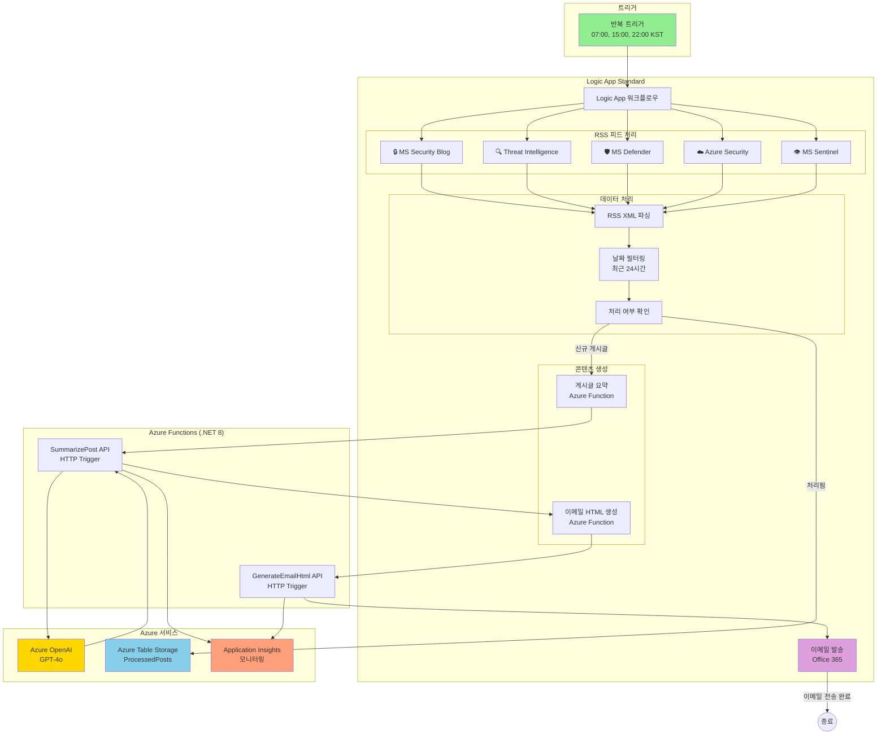
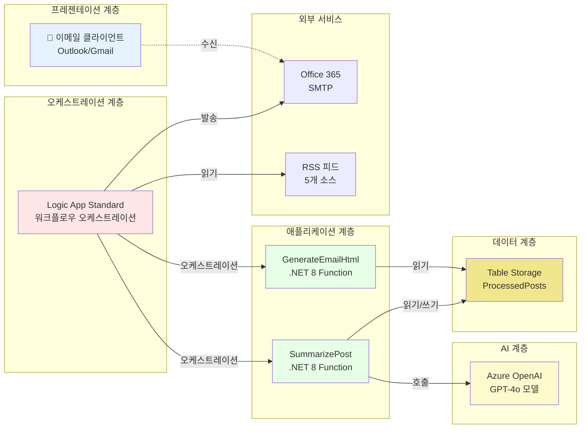
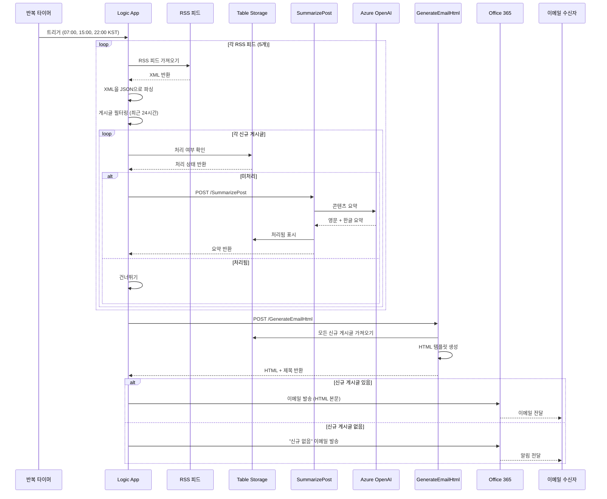
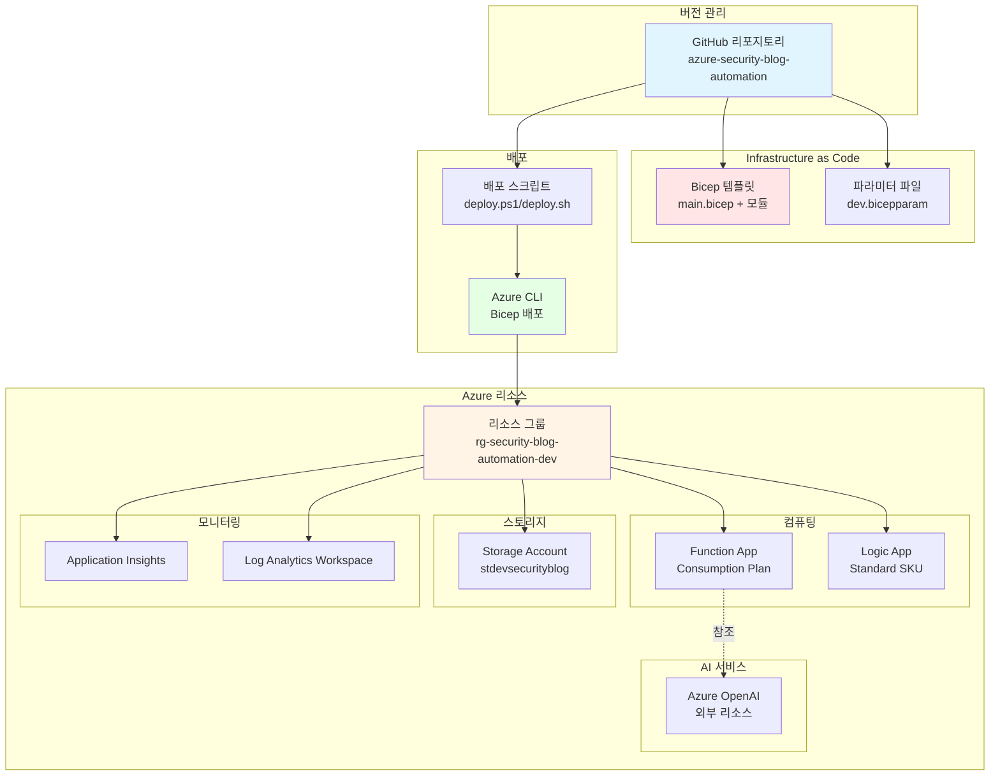

# 아키텍처 문서

## 시스템 개요

**Azure Security Blog Automation** 시스템은 Microsoft 보안 블로그 게시글을 자동으로 수집하고 요약하여 이메일로 배포하는 서버리스 이벤트 기반 솔루션입니다. Azure Logic Apps (Standard), Azure Functions (.NET 8 Isolated), Azure OpenAI, Azure Table Storage를 기반으로 실행됩니다.

## 아키텍처 다이어그램



## 컴포넌트 아키텍처



## 데이터 플로우 다이어그램



## 인프라 배포 아키텍처



## 주요 컴포넌트

### 1. Logic App Standard 워크플로우

**목적**: 전체 블로그 게시글 수집 및 이메일 생성 프로세스 오케스트레이션

**주요 기능**:
- **반복 트리거**: 매일 07:00, 15:00, 22:00 KST에 실행
- **RSS 피드 처리**: 5개의 Microsoft 보안 블로그 RSS 피드 수집 및 파싱
- **중복 제거**: Table Storage를 통해 동일한 게시글 재처리 방지
- **HTTP 액션**: Azure Functions 호출 (AI 요약 및 HTML 생성)
- **이메일 전송**: Office 365 커넥터를 통한 이메일 발송

**워크플로우 파일**: `/infra/logic-app/workflow-full.json`

### 2. Azure Functions (.NET 8 Isolated)

#### SummarizePost Function
- **트리거**: HTTP POST
- **입력**: 블로그 게시글 URL, 제목, 설명
- **처리 과정**:
  1. URL에서 게시글 콘텐츠 추출
  2. Azure OpenAI GPT-4o를 통한 요약 생성
  3. 영문 및 한글 요약 생성
  4. Table Storage에 처리됨 표시
- **출력**: JSON 형식의 요약 데이터

#### GenerateEmailHtml Function
- **트리거**: HTTP POST
- **입력**: 요약된 게시글 배열
- **처리 과정**:
  1. Table Storage에서 최근 24시간 내 신규 게시글 조회
  2. 반응형 HTML 이메일 템플릿 생성
  3. 이메일 제목 생성
  4. 신규 게시글 없음 시나리오 처리
- **출력**: HTML 본문 및 제목을 포함한 JSON

### 3. Azure Table Storage

**테이블**: `ProcessedPosts`

**스키마**:
- **PartitionKey**: 피드 소스 (예: "SecurityBlog", "ThreatIntel")
- **RowKey**: 게시글 고유 식별자 (URL 해시)
- **Title**: 게시글 제목
- **PublishedDate**: 게시 타임스탬프
- **ProcessedDate**: 처리 시간

**목적**: 
- 블로그 게시글 중복 제거
- 처리 이력 추적
- 이메일 생성 시 24시간 lookback 지원

### 4. Azure OpenAI

**모델**: GPT-4o
**배포**: `gpt-4o`

**사용 목적**:
- 블로그 게시글 콘텐츠 요약
- 간결한 영문 요약 생성 (2-3문장)
- 한글 번역 생성
- 보안 핵심 인사이트 추출

**구성**:
- 엔드포인트: 환경 변수 `AZURE_OPENAI_ENDPOINT`
- API 키: Function App 설정에 보안 저장

### 5. Application Insights

**목적**: 모니터링 및 진단

**텔레메트리**:
- Function 실행 로그
- HTTP 요청/응답 추적
- 예외 추적
- 성능 메트릭
- 사용자 정의 이벤트 (게시글 처리, 이메일 생성)

## RSS 피드 소스

| 아이콘 | 피드 이름 | URL | 콘텐츠 주제 |
|--------|-----------|-----|------------|
| 🔒 | Microsoft Security Blog | https://www.microsoft.com/en-us/security/blog/feed/ | 일반 보안 주제 |
| 🔍 | MS Security - Threat Intelligence | https://www.microsoft.com/en-us/security/blog/topic/threat-intelligence/feed/ | 위협 분석 및 인텔리전스 |
| 🛡️ | Microsoft Defender TechCommunity | https://techcommunity.microsoft.com/plugins/custom/microsoft/o365/custom-blog-rss?board=MicrosoftDefenderATPBlog | Microsoft Defender 업데이트 |
| ☁️ | Azure Security Blog | https://azure.microsoft.com/en-us/blog/topics/security/feed/ | Azure 특화 보안 |
| 👁️ | Microsoft Sentinel TechCommunity | https://techcommunity.microsoft.com/plugins/custom/microsoft/o365/custom-blog-rss?board=MicrosoftSentinelBlog | Sentinel SIEM 플랫폼 |

## 보안 및 모범 사례

### 인증 및 권한 부여
- **관리 ID**: Logic App은 시스템 할당 관리 ID 사용
- **API 키**: Azure Key Vault 또는 Function App 애플리케이션 설정에 보안 저장
- **HTTPS 전용**: 모든 엔드포인트에서 TLS 1.2+ 강제 적용

### 네트워크 보안
- **프라이빗 엔드포인트**: (선택 사항) Storage Account에 구성 가능
- **CORS**: Function App CORS를 Azure Portal로만 제한
- **IP 제한**: (선택 사항) Function App 액세스 제한 가능

### 모니터링 및 알림
- **Application Insights**: 전체 텔레메트리 및 분산 추적
- **Azure Monitor**: Function 실패 또는 높은 지연 시간에 대한 경고
- **Logic App 실행 기록**: 모든 워크플로우 실행 추적

### 비용 최적화
- **Consumption Plan**: Functions가 유휴 상태일 때 스케일링
- **Standard SKU Logic App**: 예측 가능한 가격의 고정 비용
- **Table Storage**: 중복 제거를 위한 저비용 데이터 스토리지

## 배포 모델

### Infrastructure as Code (IaC)

모든 Azure 리소스는 Bicep 템플릿으로 정의됩니다:

```
infra/bicep/
├── main.bicep                    # 메인 오케스트레이션 템플릿
├── modules/
│   ├── storage.bicep             # Storage Account + ProcessedPosts 테이블
│   ├── function-app.bicep        # Function App + App Service Plan
│   ├── logic-app.bicep           # Logic App + App Service Plan
│   └── app-insights.bicep        # Application Insights + Log Analytics
└── parameters/
    ├── dev.bicepparam            # 개발 환경
    └── prod.bicepparam           # 프로덕션 환경 (선택 사항)
```

### 배포 스크립트

- **PowerShell**: `infra/deploy.ps1` (Windows)
- **Bash**: `infra/deploy.sh` (Linux/Mac)

**기능**:
- 사전 요구사항 확인 (Azure CLI, 로그인 상태)
- 리소스 그룹 생성
- Bicep 템플릿 검증
- 자동화된 배포
- 출력 표시 (리소스 이름, URL)

## 확장성 및 성능

### 현재 용량
- **RSS 피드**: 5개 피드, 하루 ~50개 게시글
- **이메일 빈도**: 하루 3회 (07:00, 15:00, 22:00 KST)
- **Function 타임아웃**: 5분 (기본값)
- **Table Storage**: 무제한 행, 피드 소스별 파티셔닝

### 확장 고려사항
- **더 많은 RSS 피드**: Logic App 워크플로우에 병렬 브랜치 추가
- **높은 빈도**: Recurrence 트리거 조정 (cron 표현식 지원)
- **여러 수신자**: Office 365 To/CC 필드에 추가
- **대용량**: 더 나은 성능을 위해 Function App을 Premium Plan으로 업그레이드

## 재해 복구 및 백업

### 백업 전략
- **소스 코드**: GitHub에서 버전 관리
- **인프라**: Bicep 템플릿을 통해 재현 가능
- **Table Storage**: 일시 삭제 및 특정 시점 복원 활성화
- **비밀**: Azure Key Vault에 백업

### 복구 절차
1. **완전한 인프라 손실**: 
   - Bicep 템플릿으로 `deploy.ps1` 실행
   - Azure Functions Core Tools를 통해 Function App 코드 재배포
   - `/infra/logic-app/workflow-full.json`에서 Logic App 워크플로우 임포트
   - API 연결 재구성

2. **Function App 장애**:
   - 코드 재배포: `func azure functionapp publish <function-app-name>`

3. **Logic App 워크플로우 손상**:
   - Git 리포지토리에서 워크플로우 정의 임포트

## 향후 개선 사항

### 계획된 기능
- [ ] **이메일 커스터마이징**: 피드 선택을 위한 사용자 기본 설정
- [ ] **다국어**: 추가 언어 요약 지원
- [ ] **Slack/Teams 통합**: 협업 플랫폼에 요약 게시
- [ ] **히스토리 아카이브**: 과거 요약을 탐색할 수 있는 웹 프론트엔드
- [ ] **ML 기반 우선순위**: ML을 사용하여 관련성별로 게시글 순위 지정

### 인프라 개선
- [ ] **프라이빗 엔드포인트**: 향상된 네트워크 보안
- [ ] **다중 지역 배포**: Azure 지역 간 고가용성
- [ ] **Cosmos DB**: 글로벌 배포를 위해 Table Storage에서 마이그레이션
- [ ] **API Management**: 외부 통합을 위해 APIM을 통해 Functions 노출

## 참고 자료

- [Azure Logic Apps 문서](https://learn.microsoft.com/ko-kr/azure/logic-apps/)
- [Azure Functions .NET Isolated](https://learn.microsoft.com/ko-kr/azure/azure-functions/dotnet-isolated-process-guide)
- [Azure OpenAI Service](https://learn.microsoft.com/ko-kr/azure/ai-services/openai/)
- [Azure Table Storage](https://learn.microsoft.com/ko-kr/azure/storage/tables/)
- [Bicep 언어](https://learn.microsoft.com/ko-kr/azure/azure-resource-manager/bicep/)
