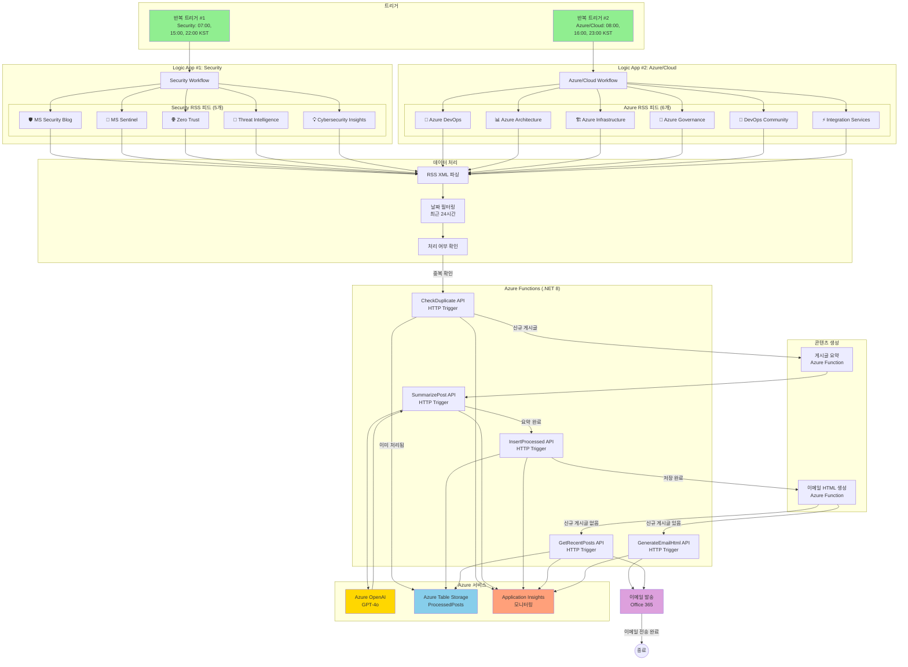
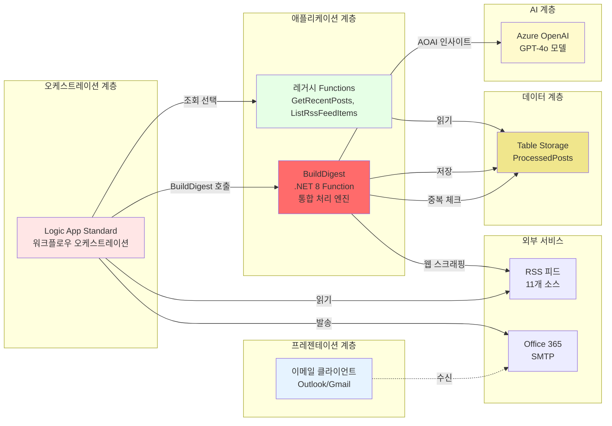
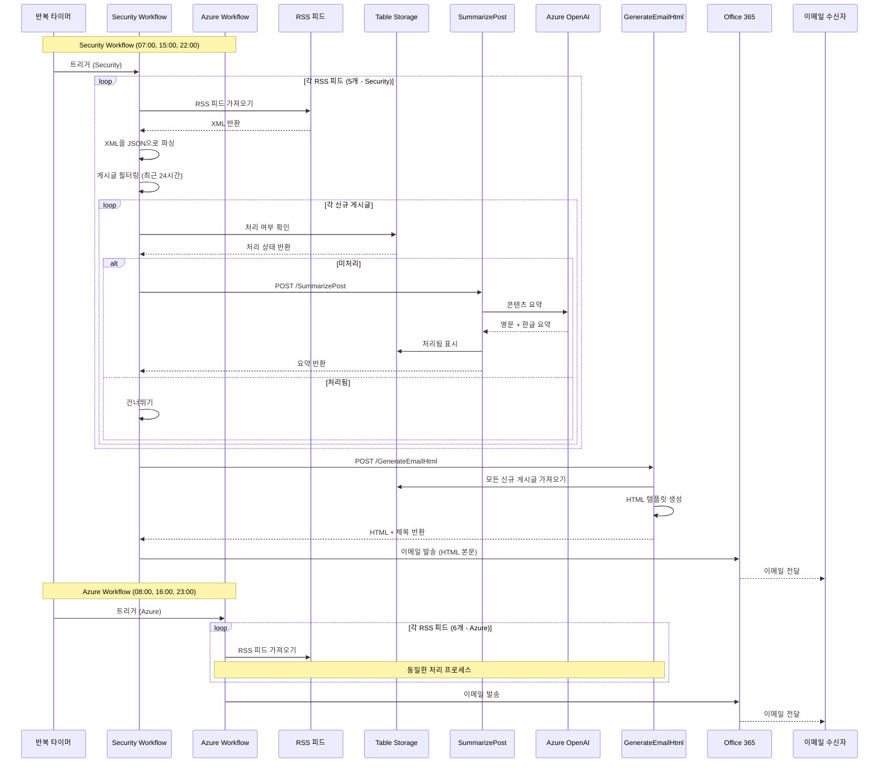

# 아키텍처 문서

## 시스템 개요

**Azure Security Blog Automation** 시스템은 Microsoft 보안 및 Azure 클라우드 블로그 게시글을 자동으로 수집하고 요약하여 이메일로 배포하는 서버리스 이벤트 기반 솔루션입니다. 

### 듀얼 워크플로우 아키텍처

시스템은 **2개의 독립적인 Logic App (Standard) 워크플로우**로 구성되어 있습니다:

1. **Security Workflow** - 5개 보안 피드 (07:00, 15:00, 22:00 KST)
2. **Azure/Cloud Workflow** - 6개 Azure 피드 (08:00, 16:00, 23:00 KST)

Azure Functions (.NET 8 Isolated), Azure OpenAI, Azure Table Storage를 기반으로 실행됩니다.

## 아키텍처 다이어그램



## 컴포넌트 아키텍처



## 데이터 플로우 다이어그램



## 인프라 배포 아키텍처


## 주요 컴포넌트

### 1. Logic App Standard 워크플로우

**목적**: 전체 블로그 게시글 수집 및 이메일 생성 프로세스 오케스트레이션

**듀얼 워크플로우 구조**:

#### Workflow #1: Security
- **반복 트리거**: 매일 07:00, 15:00, 22:00 KST에 실행
- **RSS 피드 처리**: 5개의 Microsoft 보안 블로그 RSS 피드 수집 및 파싱
  - 🛡️ Microsoft Security Blog
  - 🔐 Microsoft Sentinel Blog
  - 🌐 Zero Trust Blog
  - 🎯 Threat Intelligence
  - 💡 Cybersecurity Insights
- **중복 제거**: Table Storage를 통해 동일한 게시글 재처리 방지
- **HTTP 액션**: Azure Functions 호출 (AI 요약 및 HTML 생성)
- **이메일 전송**: Office 365 커넥터를 통한 이메일 발송

#### Workflow #2: Azure/Cloud
- **반복 트리거**: 매일 08:00, 16:00, 23:00 KST에 실행
- **RSS 피드 처리**: 6개의 Azure/Cloud 블로그 RSS 피드 수집 및 파싱
  - 🔧 Azure DevOps Blog
  - 📊 Azure Architecture Blog
  - 🏗️ Azure Infrastructure Blog
  - 🏢 Azure Governance and Management Blog
  - 🔨 Azure DevOps Community
  - ⚡ Azure Integration Services Blog
- **동일한 처리 프로세스**: Security 워크플로우와 동일한 로직

**워크플로우 파일**: 
- Security: `/infra/logic-app/workflow-full.json`
- Azure/Cloud: `/infra/logic-app/workflow-azure-cloud.json`

### 2. Azure Functions (.NET 8 Isolated)

#### 🔥 BuildDigest Function (v3.0 통합 처리 엔진)
- **트리거**: HTTP POST
- **엔드포인트**: `/api/BuildDigest`
- **입력**: 
  ```json
  {
    "rssFeedUrls": [
      {"name": "Microsoft Security Blog", "url": "https://..."}
    ],
    "cutoffHours": 24
  }
  ```
- **처리 과정**:
  1. **RSS 피드 수집**: 모든 피드를 순차 처리 (FAIL 피드 자동 skip)
  2. **웹 스크래핑**: 실제 블로그 페이지에서 첫 문단 추출 (wp-block-paragraph 패턴)
  3. **중복 제거**: Table Storage SHA256 해시 체크
  4. **AOAI 인사이트**: 배치 처리로 한국어 핵심 인사이트 생성
  5. **24시간 필터링**: newCutoff 기준으로 신규 게시물만 표시
  6. **이메일 HTML 생성**: 첫 문단 + 인사이트 포함
- **출력**: 
  ```json
  {
    "subject": "[Microsoft Azure 업데이트] 새 게시글 3개",
    "htmlBody": "<html>...</html>",
    "hasNewPosts": true
  }
  ```
- **목적**: 단일 API 호출로 전체 처리 완료 (Logic App 간소화)
- **상세 문서**: [BuildDigest-API.md](BuildDigest-API.md)

#### 레거시 Functions (v2.0, 현재 BuildDigest로 통합됨)
- `CheckDuplicate`: 중복 체크 (BuildDigest 내부 로직으로 통합)
- `SummarizePost`: 요약 생성 (BuildDigest 내부 로직으로 통합)
- `InsertProcessed`: 저장 (BuildDigest 내부 로직으로 통합)
- `GenerateEmailHtml`: HTML 생성 (BuildDigest 내부 로직으로 통합)

#### 보조 Functions (조회 전용)
- `GetRecentPosts`: 최근 처리된 게시글 조회
- `ListRssFeedItems`: RSS 피드 아이템 목록

**공통 구성**:
- **.NET 8 Isolated Worker**: 프로세스 격리 모드로 안정성 향상
- **TableServiceClient**: `AzureWebJobsStorage` 연결 문자열 사용
- **Application Insights**: 모든 Functions에서 자동 텔레메트리 수집
- **오류 처리**: Try-catch 블록으로 예외 포착, 500 상태 코드 반환

### 3. Azure Table Storage

**테이블**: `ProcessedPosts`

**스키마**:
- **PartitionKey**: 피드 소스 이름 (예: "Microsoft Security Blog", "Azure DevOps Blog")
- **RowKey**: 게시글 링크의 SHA256 해시 (Base64 URL-safe 인코딩)
- **Title**: 게시글 제목
- **Link**: 게시글 원본 URL
- **PublishDate**: 게시 타임스탬프 (ISO 8601)
- **ProcessedDate**: 처리 시간 (ISO 8601)
- **KoreanSummary**: AI 생성 한글 인사이트 (JSON 배열)
- **FirstParagraph**: 웹 스크래핑으로 추출한 첫 문단

**목적**: 
- 블로그 게시글 중복 제거 (SHA256 해시 기반)
- 처리 이력 추적 (BuildDigest에서 자동 저장)
- 최근 게시글 조회 (GetRecentPosts Function)
- 안정적 고유성 보장 (URL 변경에도 대응)

**인덱싱**:
- PartitionKey로 소스별 분리 (효율적 쿼리)
- ProcessedDate 필터로 최근 게시글 검색
- RowKey로 빠른 중복 확인 (O(1) 조회)

### 4. Azure OpenAI

**모델**: GPT-4o
**배포**: `gpt-4o`

**사용 목적**:
- 블로그 전체 분석 기반 핵심 인사이트 추출
- 한국어 3줄 요약 생성 (단순 번역 아님)
- 배치 처리로 효율성 향상
- 보안 핵심 인사이트 추출

**구성**:
- 엔드포인트: 환경 변수 `AZURE_OPENAI_ENDPOINT`
- API 키: Function App 설정에 보안 저장

### 5. Application Insights

**목적**: 모니터링 및 진단

**텔레메트리**:
- Function 실행 로그
- HTTP 요청/응답 추적
- 예외 추적
- 성능 메트릭
- 사용자 정의 이벤트 (게시글 처리, 이메일 생성)

## RSS 피드 소스

현재 **Phase 2**: 10개 피드 (Security 5 + AI Agent 2 + Azure 핵심 3)

| 아이콘 | 피드 이름 | URL | 콘텐츠 주제 |
|--------|-----------|-----|------------|
| 🔒 | Microsoft Security Blog | https://www.microsoft.com/en-us/security/blog/feed/ | 일반 보안 주제 |
| 🔍 | MS Security - Threat Intelligence | https://www.microsoft.com/en-us/security/blog/topic/threat-intelligence/feed/ | 위협 분석 및 인텔리전스 |
| 🛡️ | Microsoft Defender TechCommunity | https://techcommunity.microsoft.com/plugins/custom/microsoft/o365/custom-blog-rss?board=MicrosoftDefenderATPBlog | Microsoft Defender 업데이트 |
| ☁️ | Azure Security Blog | https://azure.microsoft.com/en-us/blog/topics/security/feed/ | Azure 특화 보안 |
| 👁️ | Microsoft Sentinel TechCommunity | https://techcommunity.microsoft.com/plugins/custom/microsoft/o365/custom-blog-rss?board=MicrosoftSentinelBlog | Sentinel SIEM 플랫폼 |
| 🤖 | Azure AI Blog | https://techcommunity.microsoft.com/plugins/custom/microsoft/o365/custom-blog-rss?board=AzureAIBlog | Azure AI 서비스, GPT-4, Copilot Studio |
| 🧠 | Microsoft 365 Copilot Blog | https://techcommunity.microsoft.com/plugins/custom/microsoft/o365/custom-blog-rss?board=Microsoft365CopilotBlog | M365 Copilot, 에이전트, 확장성 |
| ☁️ | Azure Blog | https://azure.microsoft.com/en-us/blog/feed/ | Azure 전반 업데이트, 신규 서비스 |
| ⚙️ | Azure DevOps Blog | https://devblogs.microsoft.com/devops/feed/ | DevOps, CI/CD, GitHub Actions |
| 🔷 | Microsoft Fabric Blog | https://blog.fabric.microsoft.com/en-us/blog/feed/ | Fabric, 데이터 통합, Analytics |

> **MVP 단계적 확장 계획**:
> - ✅ **Phase 1** (완료): 7개 피드 - Security 5개 + AI Agent 핵심 2개
> - ✅ **Phase 2** (현재): 10개 피드 - Azure 핵심 3개 추가
> - 🔜 **Phase 3** (최종): 12개 피드 - Apps, Entra, Architecture 추가

## 보안 및 모범 사례

### 인증 및 권한 부여
- **관리 ID**: Logic App은 시스템 할당 관리 ID 사용
- **API 키**: Azure Key Vault 또는 Function App 애플리케이션 설정에 보안 저장
- **HTTPS 전용**: 모든 엔드포인트에서 TLS 1.2+ 강제 적용

### 네트워크 보안
- **프라이빗 엔드포인트**: (선택 사항) Storage Account에 구성 가능
- **CORS**: Function App CORS를 Azure Portal로만 제한
- **IP 제한**: (선택 사항) Function App 액세스 제한 가능

### 모니터링 및 알림
- **Application Insights**: 전체 텔레메트리 및 분산 추적
- **Azure Monitor**: Function 실패 또는 높은 지연 시간에 대한 경고
- **Logic App 실행 기록**: 모든 워크플로우 실행 추적

### 비용 최적화
- **Consumption Plan**: Functions가 유휴 상태일 때 스케일링
- **Standard SKU Logic App**: 예측 가능한 가격의 고정 비용
- **Table Storage**: 중복 제거를 위한 저비용 데이터 스토리지

## 배포 모델

### Infrastructure as Code (IaC)

모든 Azure 리소스는 Bicep 템플릿으로 정의됩니다:

```
infra/bicep/
├── main.bicep                    # 메인 오케스트레이션 템플릿
├── modules/
│   ├── storage.bicep             # Storage Account + ProcessedPosts 테이블
│   ├── function-app.bicep        # Function App + App Service Plan
│   ├── logic-app.bicep           # Logic App + App Service Plan
│   └── app-insights.bicep        # Application Insights + Log Analytics
└── parameters/
    ├── dev.bicepparam            # 개발 환경
    └── prod.bicepparam           # 프로덕션 환경 (선택 사항)
```

### 배포 스크립트

- **PowerShell**: `infra/deploy.ps1` (Windows)
- **Bash**: `infra/deploy.sh` (Linux/Mac)

**기능**:
- 사전 요구사항 확인 (Azure CLI, 로그인 상태)
- 리소스 그룹 생성
- Bicep 템플릿 검증
- 자동화된 배포
- 출력 표시 (리소스 이름, URL)

## 확장성 및 성능

### 현재 용량
- **RSS 피드**: 5개 피드, 하루 ~50개 게시글
- **이메일 빈도**: 하루 3회 (07:00, 15:00, 22:00 KST)
- **Function 타임아웃**: 5분 (기본값)
- **Table Storage**: 무제한 행, 피드 소스별 파티셔닝

### 확장 고려사항
- **더 많은 RSS 피드**: Logic App 워크플로우에 병렬 브랜치 추가
- **높은 빈도**: Recurrence 트리거 조정 (cron 표현식 지원)
- **여러 수신자**: Office 365 To/CC 필드에 추가
- **대용량**: 더 나은 성능을 위해 Function App을 Premium Plan으로 업그레이드

## 재해 복구 및 백업

### 백업 전략
- **소스 코드**: GitHub에서 버전 관리
- **인프라**: Bicep 템플릿을 통해 재현 가능
- **Table Storage**: 일시 삭제 및 특정 시점 복원 활성화
- **비밀**: Azure Key Vault에 백업

### 복구 절차
1. **완전한 인프라 손실**: 
   - Bicep 템플릿으로 `deploy.ps1` 실행
   - Azure Functions Core Tools를 통해 Function App 코드 재배포
   - `/infra/logic-app/workflow-full.json`에서 Logic App 워크플로우 임포트
   - API 연결 재구성

2. **Function App 장애**:
   - 코드 재배포: `func azure functionapp publish <function-app-name>`

3. **Logic App 워크플로우 손상**:
   - Git 리포지토리에서 워크플로우 정의 임포트

## 향후 개선 사항

### 계획된 기능
- [ ] **이메일 커스터마이징**: 피드 선택을 위한 사용자 기본 설정
- [ ] **다국어**: 추가 언어 요약 지원
- [ ] **Slack/Teams 통합**: 협업 플랫폼에 요약 게시
- [ ] **히스토리 아카이브**: 과거 요약을 탐색할 수 있는 웹 프론트엔드
- [ ] **ML 기반 우선순위**: ML을 사용하여 관련성별로 게시글 순위 지정

### 인프라 개선
- [ ] **프라이빗 엔드포인트**: 향상된 네트워크 보안
- [ ] **다중 지역 배포**: Azure 지역 간 고가용성
- [ ] **Cosmos DB**: 글로벌 배포를 위해 Table Storage에서 마이그레이션
- [ ] **API Management**: 외부 통합을 위해 APIM을 통해 Functions 노출

## 참고 자료

- [Azure Logic Apps 문서](https://learn.microsoft.com/ko-kr/azure/logic-apps/)
- [Azure Functions .NET Isolated](https://learn.microsoft.com/ko-kr/azure/azure-functions/dotnet-isolated-process-guide)
- [Azure OpenAI Service](https://learn.microsoft.com/ko-kr/azure/ai-services/openai/)
- [Azure Table Storage](https://learn.microsoft.com/ko-kr/azure/storage/tables/)
- [Bicep 언어](https://learn.microsoft.com/ko-kr/azure/azure-resource-manager/bicep/)
